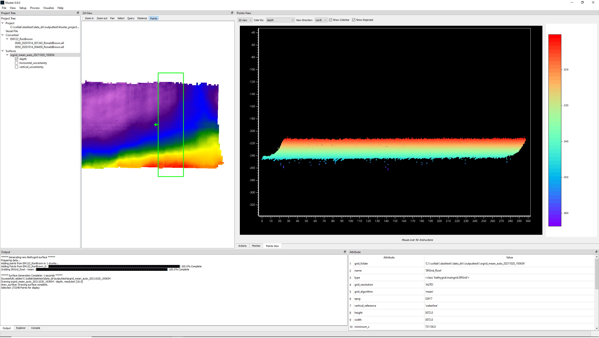
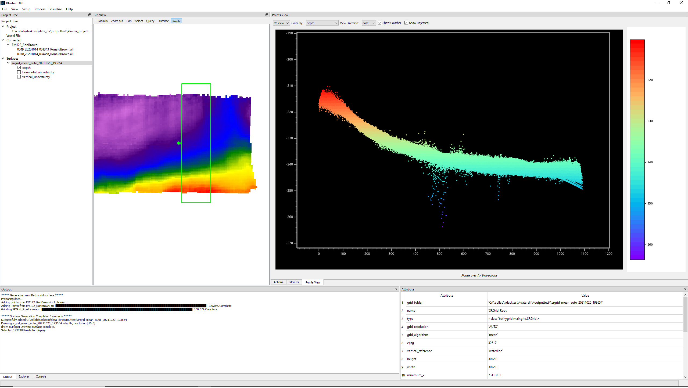
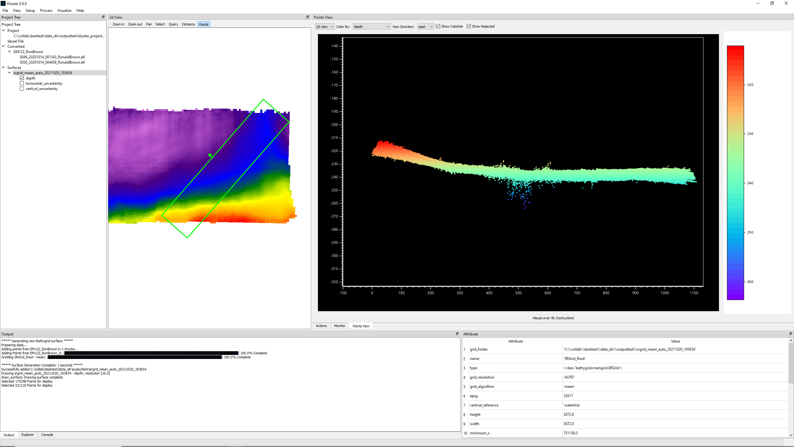
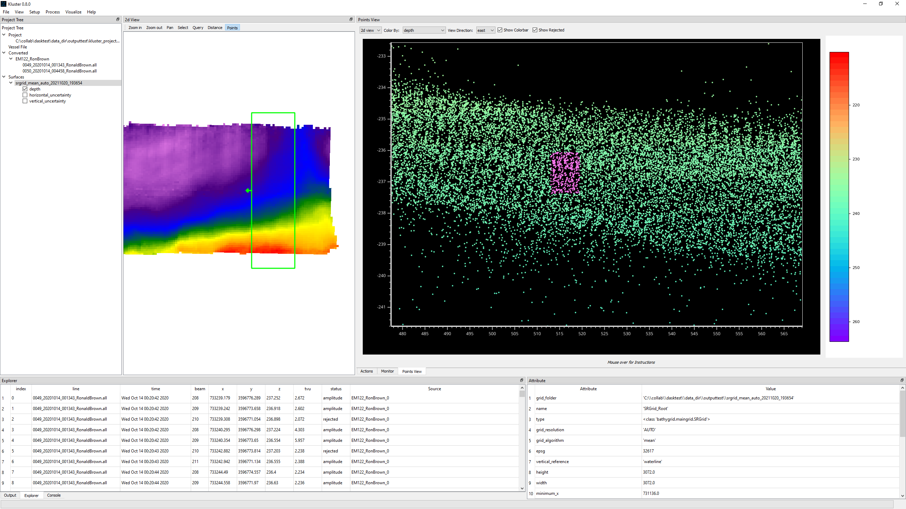
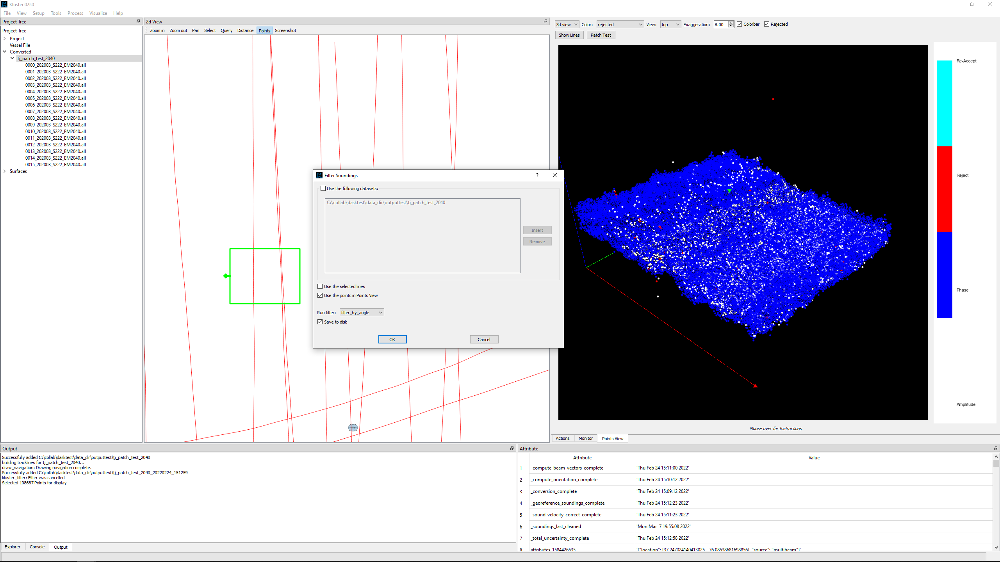

Cleaning
********

Now we can talk about visualizing points and doing some cleaning.  Cleaning is the process of removing outliers or noise
from the multibeam sonar point cloud.  In Kluster, we have a detectioninfo attribute that is associated with each point.
This detectioninfo attribute has one of the following values:

- 3 = re-accepted
- 2 = rejected
- 1 = phase detection (accepted)
- 0 = amplitude detection (accepted)

So if I were to reject a point that is currently a 'phase detection' level accepted value, it would mark that point as a '2' instead of a '1'.  Then, when I go to make a surface
from the data, it will only use the non-rejected data (detectioninfo that is not 2), effectively 'cleaning' the rejected data from the final product.

Cleaning is **not** deleting data.  Kluster retains all converted data throughout all the workflows.

Loading points
==============
The first step is to load the points in the Points View. The Points View is just that, the window that gives you a view of the multibeam point cloud.  Let's first go over the controls:

Hold the mouse over any of these controls to get more information

- View = One of '2d view', '3d view', controls the dimension of the display, two or three dimensions
- Color By = Choose the attribute to color the data by, is reflected in the color bar on the right hand side of the Points View
- View Direction = Choose the view direction of the view, 'arrow' will view the dataset in the direction of the arrow of the selection box in the 2d View
- Vertical Exaggeration (Only 3d view) = multiplier for the z value of the point cloud
- Show Colorbar = Check to show/hide the color bar on the right side of the Points View
- Show Rejected = Check to show/hide rejected soundings in the multibeam point cloud

More on these later.

Now let's select the Points tool in the 2d View and draw a box around some lines.  **Note that you must have finished processing/georeferencing to load soundings!**
Click on 'Points' at the top of the 2d View, click once in the display to set the corner, again to set the opposite corner, and a third time to load the points.
If it works, you should get a display that looks something like this.

You can get these instructions from holding the mouse over the Points button as well.

The 2d display is a little weird, and takes some getting used to.  We are in the two dimensional view, with a view direction of 'north', so what we see here is the eastings on the x axis and the depth values on the y axis.  Now our line is heading east/west, so what we probably want to do is view it along the line direction.  So let's try switching to view direction = east.  You'll see that you get a line of dots that appear to be shallower on the left side and deeper on the right side, just like the grid that we have in 2d view!  It's easier to see if you use the right mouse button to scale the display so that it zooms in a bit more.

But what if the line is going north-west, or is otherwise not a north-south or east-west line?  Well, then we need to rotate the selection box to align with the line azimuth to get the correct view.  To do that, we click on 'Points' again and follow a process similar to what we did before: click once to set the first corner, click again to set the last corner, **hold CTRL and move the mouse to rotate the selection box**, click a third time to load the points.  Let's try this out to see if we can get a north-west south-east aligned selection box.

For the 3d display, it generally doesn't matter how we rotate the selection box, as you'll see in the later sections.

Interacting in 2d
=================
First, try to mouse over the 'Mouse over for instructions' part of the Points View to get the tooltip that explains how to interact with the points.

Basically, you can move the points around with left mouse button, zoom in/out with mouse wheel and zoom in/out in a user controlled way with right mouse button.

You can select points to view more information about them by holding CTRL and dragging a box with the left mouse button.  You can view the attributes of the selected points in the Explorer window.  Selected points are highlighted in pink.

Now we can try out cleaning!  First, let's take note of a few things.  We have 'Show Rejected' as checked, so if we reject some points, they will remain in the display unchanged  unless we happen to have Color By set to 'rejected'.  Let's do that now.  We could reject points just fine with Color By set to a different mode, but you wouldn't see it in the display until you switched to the 'rejected' mode.

To reject/clean points, simply hold ALT and drag a box just like you did to select points.  If you are coloring by rejected, you will see these points turn red.

To re-accept points, simply use ALT and right mouse button.  You'll see the points turn cyan.  Cyan means 're-accepted' and indicates that the points are accepted manually.  Note that re-accepted points will not have a phase/amplitude detect description.  Try both these modes out for a bit.

.. image:: cleaning_5.png
   :target: ../_images/cleaning_5.png

There is one last thing we can try, which is to undo the changes we have made!  Note that this only works while the points are loaded, if you go to a different area and come back here, you will not be able to undo the cleaning/accepting.  Undo is pretty simple, just hold ALT and middle mouse click to watch each change revert back to what it was.  You'll see that the cyan/red go away and the original detectioninfo is now back!

Interacting in 3d
=================
Much of what we discussed with the 2d interaction works here as well.  First, let's switch to the 3d mode by changing '2d view' to '3d view' at the top of the Points View.

.. image:: cleaning_6.png
   :target: ../_images/cleaning_6.png

Basically all of the mouse controls are the same.  The one difference is that you need to use SHIFT + Left mouse button to move the camera in 3d view, where left mouse button effectively rotates the camera.

One of the big differences is the way the z scaling works.  You'll need to manually enter in a Vertical Exaggeration at the top to scale in that axis.  Try it now, you'll see that altering the Vertical Exaggeration is a way to effectively zoom in on the points in 3d view.

Cleaning is much the same as well.  You drag boxes to select, clean and accept the points.

Filter
======
All of what we have discussed so far has been centered on manual data cleaning.  In Kluster v0.9, I added the ability to run custom filters as well (Process - Filter).

A filter in Kluster is just a way to automatically reject/accept soundings based on a set algorithm for a certain part of the dataset.  See the example below:

Here, I am about to run the 'filter_by_angle' algorithm on the points currently shown in Points View, optionally saving the changes to disk.  You'll see that after hitting OK, a second screen pops up with the settings for the filter (min and max angle in our case).  These settings are then used to configure the filter, the filter runs, and you get the result.  Note that you have to have the converted entry selected for it to be used in the filtering (note that the patch test dataset shows as greyed out in the box, which is what you want).

You can also just run the filter on a line or a full dataset if you like.  The recommended approach is to test the algorithm out on the Points View selection, without saving to disk, and then if you like the results, run on the full dataset.

Writing a Custom Filter
-----------------------

I mentioned earlier that these are 'custom filters'.  Filters in Kluster are designed as plugins, where the user could write a new filter and run it in Kluster by simply including it in the right place.

All of the default included filters are in the kluster/plugins/filters folder.  All python files that have a Filter class will be recognized and runnable from the Kluster filter dialog.  In addition, in Kluster Settings, you'll see that there is an external filter directory, which if you set, Kluster will also look in this directory for potential filter files.

The simplest filter is probably the 'reject_all' filter.  This filter will simply reject all soundings by setting sounding flag to rejected.  The actual filter code is short enough to share here::

    import numpy as np

    from HSTB.kluster.modules.filter import BaseFilter
    from HSTB.kluster import kluster_variables

    class Filter(BaseFilter):
        def __init__(self, fqpr, selected_index=None):
            super().__init__(fqpr, selected_index)
            self.controls = []
            self.description = 'Reject all soundings.'

        def _run_algorithm(self):
            print(f'Running reject_all on {self.fqpr.output_folder}')
            self.new_status = []  # new_status will be a list where each element is a 2d array of new detectioninfo (sounding flag) values
            for cnt, rp in enumerate(self.fqpr.multibeam.raw_ping):  # for each sonar head...
                # build a new array of all rejected flags, same size as existing detectioninfo
                rp_detect = np.full(rp['detectioninfo'].shape, kluster_variables.rejected_flag, dtype=rp['detectioninfo'].dtype)
                # new status will be a list of arrays, one for each sonar head.
                self.new_status.append(rp_detect)
            print(f'reject_all complete')

You can see that the first thing we did was import the BaseFilter class and create a new Filter class.  You must have a Filter class in your custom filter.  You'll also want the kluster_variables data, if only to get the sounding flag values.

See the BaseFilter class for more info.

From here, you define your filter.  All filters need a controls and a description attribute.

The controls will be used to build the second filter screen that we saw when running the 'filter_by_angle', that had the min_angle and max_angle options.  See the 'filter_by_angle' for an example on how to use this.

Each list in controls will populate a new GUI control to ask for values when running from Kluster GUI, [datatype, name, start_value, qt_properties] where

- datatype = one of [float, int, text, checkbox, combobox], this controls what kind of GUI control you get
- name = sets the label of the control, MUST MATCH THE _run_algorithm KEY WORD ARGUMENT
- start_value = the starting value of the control
- qt_properties = dict of properties that QT can apply with setProperty

The description attribute will set the tool tip in the Filter GUI.

To build your algorithm, you simply define the '_run_algorithm' function and include your algorithm there.  The comments in the code block above explain the operation we've done here to reject soundings.  Basically, we built a new detectioninfo array and set it all equal to rejected and appended it to the new_status attribute.  Kluster will overwrite (assuming you save changes) the existing sounding status with the new one you add to new_status.

Detectioninfo is the name of the array that holds the sounding flag.  If you ever need a description of a variable, to help figure out what it is, you can use the variable_descriptions look up::

    from HSTB.kluster import kluster_variables

    kluster_variables.variable_descriptions['detectioninfo']
    Out[3]: 'The accepted/rejected state of each beam.  3 = re-accepted, 2 = rejected, 1 = phase detection, 0 = amplitude detection.  See Kongsberg "detectioninfo".'
    kluster_variables.variable_descriptions['z']
    Out[4]: 'The result of running Georeference in Kluster.  This is the sound velocity offsets projected into the coordinate reference system you chose.  Depth is in meters from the vertical reference you chose.'
    kluster_variables.variable_descriptions['corr_pointing_angle']
    Out[5]: 'The result of running Compute Beam Vectors in Kluster.  This is the raw beam angles corrected for attitude and mounting angles, relative to nadir (straight down from sonar).'

Regridding
==========

After cleaning, you will want to update the surface to reflect the new changes in the point cloud.  Each time you clean, it sets a new date for the last cleaning action for each day of data.  This allows the grid to check this date to see if the grid is older than the last cleaned date.  If it is, the grid will be marked with an asterisk to identify it as out of date in the surface data dialog.  See Surfacing - Updating a Surface.