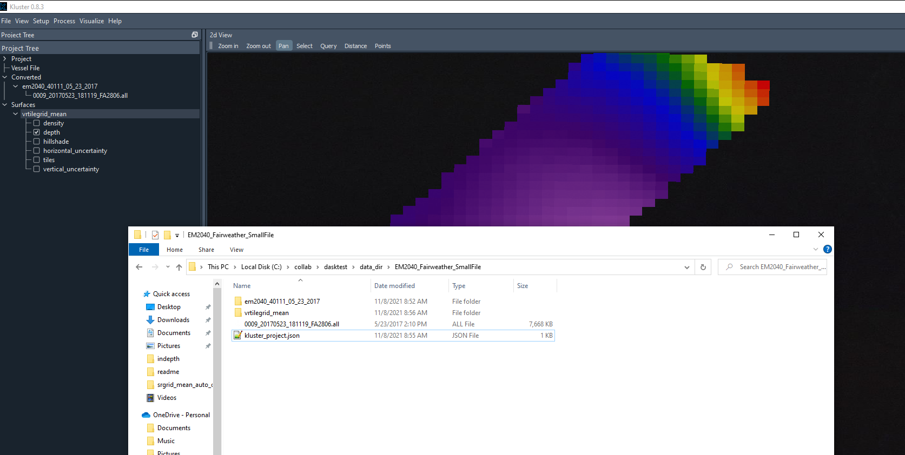
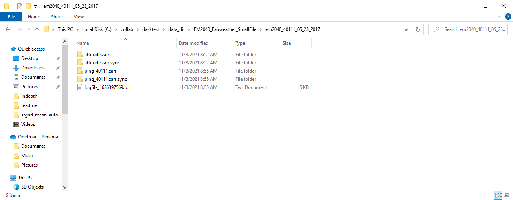
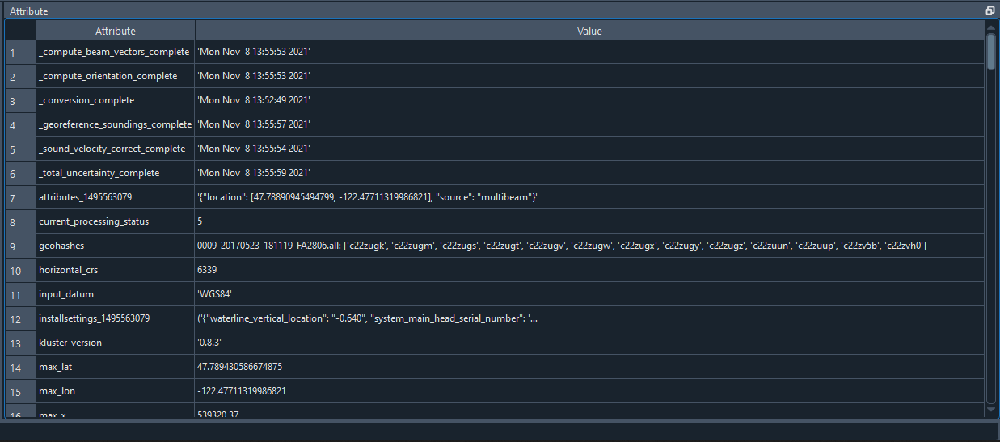

Data Structures
***************

There are two main data structures in the Kluster software: the processed multibeam data (Fqpr) and the gridded dataset (Bathygrid).  Here we will talk about both of these in detail, as well as the lightweight project structure that holds both.  Let's start with an example:

Here we see the three main elements as they are generated in Kluster.

You drag in a new multibeam file, start the conversion process and see a new folder ("EM2040_40111_05_23_2017" in our case) appear next to the multibeam file with a similar entry in the Kluster application under 'Converted'.  This is the Fully Qualified Ping Record structure that Kluster uses to hold all the converted multibeam/sound velocity/positioning data as well as all the intermediate and fully processed multibeam records.

At the same time, a 'kluster_project.json' file, the project file, is created which holds your project settings and the paths to the different folders.  Unless you want to use the project file to manage large projects, this can basically be ignored, and you can just work with the data folders, dragging in new folders to view in Kluster.

Finally, after fully processing the data, you can create a new surface, which we show here as the 'vrtilegrid_mean' folder, which tells you that this is a VR surface created in Bathygrid using the 'mean' algorithm to determine the value in each cell of the grid.

Let's discuss each of these in more detail.

Fully Qualified Ping Record
===========================

The Fully Qualified Ping Record (FQPR) is the data structure that contains all of the converted, intermediate and final multibeam data.  When converting data through the GUI (which uses the Kluster Intelligence module), each converted folder represents one FQPR object, which represents one sonar for one day's worth of data.

"EM2040_40111_05_23_2017" = A Kongsberg EM2040 with serial number 40111 with data only during the day of May 23, 2017

You can actually use Kluster to just convert any lines to a folder, but the Kluster GUI forces you to use this scheme.  This allows you to drag in files from anywhere, knowing nothing about where they come from or which sensor they belong to, and Kluster will automatically organize them into neat little datasets.

So let's talk about what is in one of these FQPR objects.  We'll use the console to reload a processed FQPR dataset and print the summary. Note that 'reload_data' is the function used to reload FQPR data when you drag the folder into the GUI as well.  I'm just showing it on the console to illustrate a few things.

.. code-block:: python

    > from HSTB.kluster.fqpr_convenience import reload_data

    > fq = reload_data(r"C:\collab\dasktest\data_dir\outputtest\tj_patch_test_2040")
    Starting local cluster client...
    <Client: 'tcp://127.0.0.1:58960' processes=8 threads=16, memory=34.27 GB>
    ****Reloading from file C:\collab\dasktest\data_dir\outputtest\tj_patch_test_2040****
    Successfully reloaded

    > fq
    Out[4]:
    FQPR: Fully Qualified Ping Record built by Kluster Processing
    -------------------------------------------------------------
    Contains:
    1 sonar head, 56662 pings, version 0.7.11
    Start: Tue Mar 17 06:28:55 2020 UTC
    End: Tue Mar 17 09:51:22 2020 UTC
    Minimum Latitude: 37.24927016765822 Maximum Latitude: 37.250005179442404
    Minimum Longitude: -76.08749809374879 Maximum Longitude: -76.08357163911866
    Minimum Northing: 4122665.067 Maximum Northing: 4123756.035
    Minimum Easting: 403547.631 Maximum Easting: 403941.398
    Minimum Depth: 12.287 Maximum Depth: 42.907
    Current Status: tpu complete
    Sonar Model Number: em2040
    Primary/Secondary System Serial Number: 40072/0
    Horizontal Datum: 6347
    Vertical Datum: NOAA MLLW
    Navigation Source: sbet
    Sound Velocity Profiles: 1

The print out summary for the FQPR record shows some of the useful attributes for the object.  You can access them pretty readily using the properties as well.

.. code-block:: python

    > fq.min_time
    Out[5]: 'Tue Mar 17 06:28:55 2020 UTC'

    > fq.max_time
    Out[6]: 'Tue Mar 17 09:51:22 2020 UTC'

    > fq.sonar_model
    Out[7]: 'em2040'

    > fq.status
    Out[8]: 'tpu'

To get at the data however, you'll need to access the multibeam object.  The multibeam object contains the Xarray Datasets for the ping records and the attitude records, which are the two datasets contained within the FQPR data structure.

.. code-block:: python

    > fq.multibeam.raw_ping
    Out[9]:
    [<xarray.Dataset>
     Dimensions:                    (beam: 400, time: 56662, xyz: 3)
     Coordinates:
       * beam                       (beam) int32 0 1 2 3 4 5 ... 395 396 397 398 399
       * time                       (time) float64 1.584e+09 1.584e+09 ... 1.584e+09
       * xyz                        (xyz) <U1 'x' 'y' 'z'
     Data variables: (12/43)
         acrosstrack                (time, beam) float32 dask.array<chunksize=(1000, 400), meta=np.ndarray>
         alongtrack                 (time, beam) float32 dask.array<chunksize=(1000, 400), meta=np.ndarray>
         altitude                   (time) float32 dask.array<chunksize=(1000,), meta=np.ndarray>
         beampointingangle          (time, beam) float32 dask.array<chunksize=(1000, 400), meta=np.ndarray>
         corr_altitude              (time) float64 dask.array<chunksize=(1000,), meta=np.ndarray>
         corr_heave                 (time) float64 dask.array<chunksize=(1000,), meta=np.ndarray>
         ...                         ...
         tx                         (time, beam, xyz) float32 dask.array<chunksize=(1000, 400, 3), meta=np.ndarray>
         txsector_beam              (time, beam) uint8 dask.array<chunksize=(1000, 400), meta=np.ndarray>
         x                          (time, beam) float64 dask.array<chunksize=(1000, 400), meta=np.ndarray>
         y                          (time, beam) float64 dask.array<chunksize=(1000, 400), meta=np.ndarray>
         yawpitchstab               (time) <U2 dask.array<chunksize=(1000,), meta=np.ndarray>
         z                          (time, beam) float32 dask.array<chunksize=(1000, 400), meta=np.ndarray>
     Attributes: (12/53)
         _compute_beam_vectors_complete:    Thu Sep 30 15:39:26 2021
         _compute_orientation_complete:     Thu Sep 30 15:38:41 2021
         _conversion_complete:              Thu Sep 30 15:37:47 2021
         _georeference_soundings_complete:  Thu Nov  4 21:22:56 2021
         _sound_velocity_correct_complete:  Thu Sep 30 15:39:46 2021
         _soundings_last_cleaned:           Thu Oct 28 18:35:49 2021
             ...                                ...
         system_identifier:                 40072
         system_serial_number:              [40072]
         units:                             {'acrosstrack': 'meters (+ starboard)'...
         vertical_crs:                      COMPOUNDCRS["NAD83(2011) + MLLW depth"...
         vertical_reference:                NOAA MLLW
         xyzrph:                            {'beam_opening_angle': {'1584426535': ...]

    > fq.multibeam.raw_att
    Out[10]:
    <xarray.Dataset>
    Dimensions:  (time: 192975)
    Coordinates:
      * time     (time) float64 1.584e+09 1.584e+09 ... 1.584e+09 1.584e+09
    Data variables:
        heading  (time) float32 dask.array<chunksize=(20000,), meta=np.ndarray>
        heave    (time) float32 dask.array<chunksize=(20000,), meta=np.ndarray>
        pitch    (time) float32 dask.array<chunksize=(20000,), meta=np.ndarray>
        roll     (time) float32 dask.array<chunksize=(20000,), meta=np.ndarray>
    Attributes:
        reference:  {'heading': 'reference point', 'heave': 'transmitter', 'pitch...
        units:      {'heading': 'degrees', 'heave': 'meters (+ down)', 'pitch': '...

This corresponds to the folders within the "EM2040_40111_05_23_2017" folder.  You'll see they are saved in the zarr format, which is a compressed chunked data format.  There are matching 'sync' folders, which are there for file locking and multiprocessing access.

You might have noticed that raw_ping is a list.  Each sonar head corresponds to an element in the list, for most sonars that only have one head this will always be a single element list.

Xarray allows you to do things like quickly interpolate one dataset to the coordinates of another.  A common thing you might want to do is get the attitude records for the nearest ping time.  You might ask why the two datasets are kept separate in the first place.  I use the full attitude record to get the attitude during the ping across the array, which I found to improve the accuracy of the beam vector generation.  Anyway, to get the attitude at ping time, you simply:

.. code-block:: python

    > fq.multibeam.raw_att.interp_like(fq.multibeam.raw_ping[0])
    Out[11]:
   <xarray.Dataset>
    Dimensions:  (time: 56662)
    Coordinates:
      * time     (time) float64 1.584e+09 1.584e+09 ... 1.584e+09 1.584e+09
    Data variables:
        heading  (time) float32 dask.array<chunksize=(56662,), meta=np.ndarray>
        heave    (time) float32 dask.array<chunksize=(56662,), meta=np.ndarray>
        pitch    (time) float32 dask.array<chunksize=(56662,), meta=np.ndarray>
        roll     (time) float32 dask.array<chunksize=(56662,), meta=np.ndarray>
    Attributes:
        reference:  {'heading': 'reference point', 'heave': 'transmitter', 'pitch...
        units:      {'heading': 'degrees', 'heave': 'meters (+ down)', 'pitch': '...

The dataset is organized into three main containers: coordinates, variables and attributes.

Attributes
^^^^^^^^^^

Attributes is the simplest, and powers the attributes window in the Kluster GUI.

.. code-block:: python

    > fq.multibeam.raw_ping[0].attrs
    Out[4]:
    {'_compute_beam_vectors_complete': 'Thu Sep 30 15:39:26 2021',
     '_compute_orientation_complete': 'Thu Sep 30 15:38:41 2021',
     '_conversion_complete': 'Thu Sep 30 15:37:47 2021',
     '_georeference_soundings_complete': 'Thu Nov  4 21:22:56 2021',
     '_sound_velocity_correct_complete': 'Thu Sep 30 15:39:46 2021',
     '_soundings_last_cleaned': 'Thu Oct 28 18:35:49 2021',
     '_total_uncertainty_complete': 'Thu Nov  4 21:23:30 2021',
     'attributes_1584426535': '{"location": [37.247024140413025, -76.08538681698856], "source": "multibeam"}',
     'current_processing_status': 5,
           ...

The attributes window in Kluster shows the attributes from both datasets for you to view.  Here is a description of the attributes in the datasets.

- _compute_beam_vectors_complete - the time of the last beam correction process, this is the second step in the Kluster processing pipeline
- _compute_orientation_complete - the time of the last orientation process, this is the first step in the Kluster processing pipeline
- _conversion_complete - the time of the last conversion process, the step that builds the Kluster datasets
- _georeference_soundings_complete - the time of the last georeferencing process, the fourth step in the Kluster processing pipeline
- _sound_velocity_correct_complete - the time of the last sound velocity correction process, the third step in the Kluster processing pipeline
- _soundings_last_cleaned - the time of the last sounding rejection process, either through filter or manually cleaning soundings in Points View
- _total_uncertainty_complete - the time of the last TPU process, the fifth step in the Kluster processing pipeline
- attributes_XXXXXXXXXXX - the attributes corresponding to a sound velocity profile, the XXXXXXXXXXX represents the time of the profile in UTC seconds
- current_processing_status - the current status of the FQPR record, the last successful process run, see 'status_lookup'
- geohashes - the geohash regions that each line goes through, see 'Learn more about Kluster - Geohashes'
- horizontal_crs - the epsg for the horizontal coordinate reference system that we used to build the 'x' 'y' and 'z' data
- input_datum - the datum descriptor for the raw navigation from the multibeam data
- installsettings_XXXXXXXXXXX - the installation record in its raw form from the multibeam data, the XXXXXXXXXXX represents the time of the record in UTC seconds
- kluster_version - the version of Kluster used to produce this data
- max_lat - the maximum latitude from the Latitude variable that we get from the raw multibeam data
- max_lon- the maximum longitude from the Latitude variable that we get from the raw multibeam data
- max_x - the maximum easting that we get from the georeference process in Kluster
- max_y - the maximum northing that we get from the georeference process in Kluster
- max_z - the maximum depth that we get from the georeference process in Kluster
- min_lat - the minimum latitude from the Latitude variable that we get from the raw multibeam data
- min_lon- the minimum longitude from the Latitude variable that we get from the raw multibeam data
- min_x - the minimum easting that we get from the georeference process in Kluster
- min_y - the minimum northing that we get from the georeference process in Kluster
- min_z - the minimum depth that we get from the georeference process in Kluster
- multibeam_files - the multibeam files in this dataset provided with the start and end times of the file in UTC seconds
- nav_error_files (IF SBET ERROR IS PROVIDED) - the smrmsg files used in this dataset with the start and end times of the file in week seconds
- nav_files (IF SBET IS PROVIDED) - the sbet files used in this dataset with the start and end times of the file in week seconds
- navigation_source - either 'sbet' if sbet was used during georeferencing or 'multibeam' if raw navigation from the multibeam data was used
- output_path - the current location of the FQPR object
- profile_XXXXXXXXXXX - the sound velocity profile data (depth vs sound speed), the XXXXXXXXXXX represents the time of the cast in UTC seconds
- reference - the reference point for each applicable variable
- runtimesettings_XXXXXXXXXXX - the raw runtime parameters entry from the multibeam data, the XXXXXXXXXXX represents the time of the record in UTC seconds
- sbet_datum (IF SBET IS PROVIDED) - the coordinate system of the sbet, either 'NAD83' or 'WGS84'
- sbet_logging rate (hz) (IF SBET IS PROVIDED) - the logging rate of the sbet
- sbet_mission_date (IF SBET LOG IS PROVIDED) - the date of the POSPac project
- secondary_system_serial_number - if this is a dual head sonar, this is a list containing the serial number of the second head
- sonartype - the sonar model number of the sonar
- status_lookup - the meaning of the value stored in 'current_processing_status'
- survey_number - read from the multibeam data, this is not used in Kluster, but is retained in case you need it
- svmode - the sound velocity cast selection algorithm used
- system_identifier - the main identifier for the system, this is a duplicate of the system serial number that we use during processing
- system_serial_number - a list containing the serial number of the first head
- units - the units for each variable
- vertical_crs - when using a vyperdatum enabled datum, NOAA_MLLW for example, this attribute stores the WKT string of the vertical datum
- vertical_reference - the vertical reference you select in the project settings
- xyzrph - the dictionary of lever arms and angles that we use during processing.  Initially this is a translation of the installsettings_XXXXXXXXXXX records.  This dictionary stores each new entry by the time of it's appearance in the file in UTC seconds.

Coordinates
^^^^^^^^^^^

The coordinates are simply the data for the time/beam/xyz dimensions.  Time is the time of ping, beam is the beam number, and xyz is the 3d vector only used for the TX and RX variables.

.. code-block:: python

    > fq.multibeam.raw_ping[0].time
    Out[5]:
    <xarray.DataArray 'time' (time: 56662)>
     array([1.584427e+09, 1.584427e+09, 1.584427e+09, ..., 1.584439e+09,
           1.584439e+09, 1.584439e+09])
     Coordinates:
       * time     (time) float64 1.584e+09 1.584e+09 ... 1.584e+09 1.584e+09
     Attributes:
         _FillValue:  nan

    > fq.multibeam.raw_ping[0].beam
    Out[7]:
    <xarray.DataArray 'beam' (beam: 400)>
     array([  0,   1,   2, ..., 397, 398, 399])
     Coordinates:
       * beam     (beam) int32 0 1 2 3 4 5 6 7 8 ... 392 393 394 395 396 397 398 399
     Attributes:
         _FillValue:  999

    > fq.multibeam.raw_ping[0].xyz
    Out[8]:
    <xarray.DataArray 'xyz' (xyz: 3)>
     array(['x', 'y', 'z'], dtype='<U1')
     Coordinates:
       * xyz      (xyz) <U1 'x' 'y' 'z'
     Attributes:
         _FillValue:

When you isolate a variable, it will provide the variable data as well as the coordinates of the variable.  For instance, 'beampointingangle' is the raw beam angle in degrees for each beam.  It is a two dimensional array, with a value for each ping for each beam.  So the display for beampointingangle shows the two coordinate arrays as well.

.. code-block:: python

    > fq.multibeam.raw_ping[0].beampointingangle
    Out[9]:
    <xarray.DataArray 'beampointingangle' (time: 56662, beam: 400)>
     dask.array<xarray-beampointingangle, shape=(56662, 400), dtype=float32, chunksize=(1000, 400), chunktype=numpy.ndarray>
     Coordinates:
       * beam     (beam) int32 0 1 2 3 4 5 6 7 8 ... 392 393 394 395 396 397 398 399
       * time     (time) float64 1.584e+09 1.584e+09 ... 1.584e+09 1.584e+09
     Attributes:
         _FillValue:  nan

Variables
^^^^^^^^^

The variables contain the actual converted and processed data for the FQPR object.  You can access the Xarray DataArray for the variable:

.. code-block:: python

    > fq.multibeam.raw_ping[0].beampointingangle
    Out[9]:
    <xarray.DataArray 'beampointingangle' (time: 56662, beam: 400)>
     dask.array<xarray-beampointingangle, shape=(56662, 400), dtype=float32, chunksize=(1000, 400), chunktype=numpy.ndarray>
     Coordinates:
       * beam     (beam) int32 0 1 2 3 4 5 6 7 8 ... 392 393 394 395 396 397 398 399
       * time     (time) float64 1.584e+09 1.584e+09 ... 1.584e+09 1.584e+09
     Attributes:
         _FillValue:  nan

The underlying Dask array:

.. code-block:: python

    > fq.multibeam.raw_ping[0].beampointingangle.data
    Out[13]: dask.array<xarray-beampointingangle, shape=(56662, 400), dtype=float32, chunksize=(1000, 400), chunktype=numpy.ndarray>

The loaded numpy data:

.. code-block:: python

    > fq.multibeam.raw_ping[0].beampointingangle.values
    Out[14]:
    array([[-61.53    , -61.399998, -61.28    , ...,  58.219997,  58.35    ,
             58.469997],
           [-61.53    , -61.399998, -61.28    , ...,  58.219997,  58.35    ,
             58.469997],
           [-61.55    , -61.42    , -61.3     , ...,  58.199997,  58.329998,
             58.449997],
           ...,
           [-61.19    , -61.059998, -60.94    , ...,  58.559998,  58.69    ,
             58.809998],
           [-61.19    , -61.059998, -60.94    , ...,  58.559998,  58.69    ,
             58.809998],
           [-61.19    , -61.059998, -60.94    , ...,  58.559998,  58.69    ,
             58.809998]], dtype=float32)

And information about the backend and how it is saved to disk:

.. code-block:: python

    > fq.multibeam.raw_ping[0].beampointingangle.encoding
    Out[33]:
    {'chunks': (1000, 400),
     'preferred_chunks': {'time': 1000, 'beam': 400},
     'compressor': Blosc(cname='lz4', clevel=5, shuffle=SHUFFLE, blocksize=0),
     'filters': None,
     'dtype': dtype('float32')}

Finally, here is a brief description of each variable, and the information it contains:

- acrosstrack - The result of running Sound Velocity Correct in Kluster.  This is the acrosstrack (perpendicular to vessel movement) distance to the beam footprint on the seafloor from the vessel reference point in meters.
- alongtrack - The result of running Sound Velocity Correct in Kluster.  This is the alongtrack (vessel direction) distance to the beam footprint on the seafloor from the vessel reference point in meters.
- altitude - From the raw multibeam data, the logged altitude data from the navigation system in meters.  Relative to the ellipsoid chosen in the navigation system setup.
- beam - an array of beam numbers for each beam in the ping, starting with 0
- beampointingangle - The raw beam angle that comes from the multibeam data.  Angle in degrees from the receiver to the beam footprint on the seafloor, does not take attitude or mounting angles into account.
- corr_altitude - If this dataset is processed to the waterline this will be zero.  Otherwise, the altitude correction is the attitude rotated lever arm between the reference point of the altitude and the transmitter, if non-zero.  This will be the original altitude plus this correction.
- corr_heave - If this dataset is processed to the ellipse this will be zero.  Otherwise, the heave correction is the attitude rotated lever arm between the reference point of the heave and the transmitter, if non-zero. This will be the original heave plus this correction.
- corr_pointing_angle - The result of running Compute Beam Vectors in Kluster.  This is the raw beam angles corrected for attitude and mounting angles, relative to nadir (straight down from sonar).
- counter - The identification number assigned to each ping.  For Kongsberg .all, this is a 16bit number, so you will see it reset at 65536.
- datum_uncertainty - Included when VDatum is used for vertical transformation to NOAA Chart Datums, is the uncertainty of that transform.  Will be all zeros if NOAA_MLLW/NOAA_MHW is not selected.
- delay - The time delay applied to each sector, expanded to the beam dimension.  Comes from the multibeam raw data.  Generally fairly small, or zero.
- depthoffset - The result of running Sound Velocity Correct in Kluster.  This is the down (positive down) distance to the beam footprint on the seafloor from the transmitter in meters.  Not from the vessel reference point to align with Kongsberg svcorrect convention.  We apply the z lever arm in georeferencing.
- detectioninfo - The accepted/rejected state of each beam.  3 = re-accepted, 2 = rejected, 1 = phase detection, 0 = amplitude detection.  See Kongsberg "detectioninfo".
- frequency - The frequency of each beam in Hz.
- geohash - The computed base32 representation of the geohash, a code that defines the location of each beam in a region. Plotting will show the unique integer identifier instead of the string, for visualization purposes.
- latitude - From the raw multibeam data, the logged latitude data from the navigation system in degrees.
- longitude - From the raw multibeam data, the logged longitude data from the navigation system in degrees.
- mode - The first mode value. (if TX Pulse Form) CW for continuous waveform, FM for frequency modulated, MIX for mix between FM and CW. (if Ping mode) VS for Very Shallow, SH for Shallow, ME for Medium, DE for Deep, VD for Very Deep, ED for Extra Deep.
- modetwo - The second mode value. (if Pulse Length) vsCW = very short continuous waveform, shCW = short cw, meCW = medium cw, loCW = long cw, vlCW = very long cw, elCW = extra long cw, shFM = short frequency modulated, loFM = long fm. (if Depth Mode) VS = Very Shallow, SH = Shallow, ME = Medium, DE = Deep, DR = Deeper, VD = Very Deep, ED = Extra deep, XD = Extreme Deep, if followed by "m" system is in manual mode.
- ntx - The number of sectors in each ping
- processing_status - The Kluster processing status of each beam, the highest state of the beam.  EX: If 3, sounding is only processed up to sound velocity correction. 0 = converted, 1 = orientation, 2 = beamvector, 3 = soundvelocity, 4 = georeference, 5 = tpu.
- qualityfactor - The raw uncertainty record that comes from the multibeam.  Corresponds to the Kongsberg detectioninfo (.all) detectiontype (.kmall).  See datagram description for more information.
- rel_azimuth - The result of running Compute Beam Vectors in Kluster.  This is the direction to the beam footprint on the seafloor from the sonar in radians.
- rx - the computed receive vector representing the orientation of the sonar receiver, generated during the Orientation process
- sbet_altitude - From the imported post processed navigation, the exported altitude data in meters.  Relative to the ellipsoid chosen in the post processing software.
- sbet_down_position_error - From the imported post processed navigation, the logged down position error from the navigation system in meters.
- sbet_east_position_error - From the imported post processed navigation, the logged east position error data from the navigation system in meters.
- sbet_heading_error - From the imported post processed navigation, the logged heading error data from the navigation system in degrees.
- sbet_latitude - From the imported post processed navigation, the logged latitude data from the navigation system in degrees.
- sbet_longitude - From the imported post processed navigation, the logged longitude data from the navigation system in degrees.
- sbet_north_position_error - From the imported post processed navigation, the logged north position error data from the navigation system in meters.
- sbet_pitch_error - From the imported post processed navigation, the logged pitch error data from the navigation system in degrees.
- sbet_roll_error - From the imported post processed navigation, the logged roll error data from the navigation system in degrees.
- soundspeed - The surface sound velocimeter data, in meters per second.
- thu - The Hare-Godin-Mayer TPU model - horizontal component.  In meters, 2sigma value.
- tiltangle - Steering angle of the sector transmit beam, in degrees.
- time - The time of each ping in UTC seconds
- traveltime - The two way travel time of each beam in seconds.
- tvu - The Hare-Godin-Mayer TPU model - vertical component.  In meters, 2sigma value.
- tx - the computed transmit vector representing the orientation of the sonar transmitter, generated during the Orientation process
- txsector_beam - The sector number of each beam.
- x - The result of running Georeference in Kluster.  This is the sound velocity offsets projected into the coordinate reference system you chose.  Easting is in meters.
- xyz - coordinate array for the tx and rx variables, length 3 array representing the three dimensional nature of these vectors
- y - The result of running Georeference in Kluster.  This is the sound velocity offsets projected into the coordinate reference system you chose.  Northing is in meters.
- yawpitchstab - Tells you whether yaw/pitch stabilization was enabled on the sonar.  Y = Only yaw stab, P = Only pitch stab, PY = Pitch and yaw stab, N = Neither.
- z - The result of running Georeference in Kluster.  This is the sound velocity offsets projected into the coordinate reference system you chose.  Depth is in meters from the vertical reference you chose.
