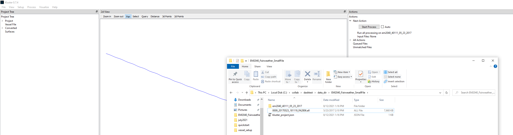

Conversion and Processing
*************************

Here we will talk about the conversion and processing steps, what they mean, how they work and what the resulting data looks like.  Kluster automates all of this for you, so you can process multibeam data without really understanding any of this.  Where this becomes useful, is when you process data and then wonder 'why are these two lines not at roughly the same depth?' or 'why did only part of this line process?'.  So hopefully what I'm sharing here will help understand the behind the scenes elements of Kluster to help answer any questions you might have!

Note that each beam keeps a status (processing status) telling which step it is on.  You can view this in basic plots as a histogram or image to get a sense of the state of the dataset.

processing status = 0 (conversion complete)
processing status = 1 (orientation complete)
processing status = 2 (beam vector complete)
processing status = 3 (sound velocity complete)
processing status = 4 (georeference complete)
processing status = 5 (tpu complete)

Conversion
==========

The first step in Kluster is to convert the data from the raw multibeam format to the Kluster data format.  This is the first action that appears on dragging in a new multibeam file.  

.. image:: processing_1.png
   :target: ../_images/processing_1.png

But what does conversion really mean?  Well, let's take a closer look.  I'm going to go ahead and convert this line, to get the converted data folder.

This folder contains all the converted data that matches up with this day.  If you look inside, you'll see a bunch of directories kind of like this:

- attitude.zarr  (a separate dataset because we keep attitude data at a higher frequency than the ping record)
    - heading - (heading of the vessel in degrees vs time)
    - heave - (heave of the vessel in meters vs time)
    - pitch - (pitch of the vessel in degrees vs time)
    - roll - (roll of the vessel in degrees vs time)
    - time - (time values in UTC seconds)
- ping_40111.zarr  (this would be the serial number of your system, if you are dual head, you'll see two ping folders, one for each head)
    - altitude - (altitude in meters vs time)
    - beam - (array of beam numbers)
    - beampointingangle - (raw beam angle in degrees vs time/beam)
    - counter - (the ping counter for each ping vs time)
    - delay - (the time delay applied to each beam vs time/beam)
    - detectioninfo - (the accepted/rejected flag for each beam vs time/beam)
    - frequency - (the frequency of each beam in Hertz vs time/beam)
    - latitude - (the latitude value for each ping vs time)
    - longitude - (the longitude value for each ping vs time)
    - mode - (the first ping mode value for the ping vs time)
    - modetwo - (the second ping mode value for the ping vs time)
    - ntx - (the number of sectors for each ping vs time
    - processing_status - (the status of each beam from 0=converted to 5=tpu corrected vs time/beam)
    - qualityfactor - (the raw uncertainty record from the multibeam data vs time/beam)
    - soundspeed - (the surface sound velocity data in meters per second vs time)
    - tiltangle - (the steering angle of the sector transmit beam in degrees vs time/beam)
    - time - (time values in UTC seconds)
    - traveltime - (the two way travel time of each beam in seconds vs time/beam)
    - txsector_beam - (the sector number associated with each beam vs time/beam)
    - yawpitchstab - (the yaw/pitch stabilization flag for each ping vs time)

Kluster saves all this data using Xarray and Zarr.  Zarr builds little chunks of data that are fast to load and use later.  If you look inside beampointingangle for instance, you'll see a few different files.

- .zarray - (the size of this array and other metadata needed to make sense of beampointingangle data)
- .zattrs - (the dimension names and other attributes associated with the beampointingangle data)
- 0.0, 0.1, etc. - (the actual binary data, stored in 1000 ping chunks, each one of these is the data for 1000 pings in Kluster)

But we aren't going to get much out of just looking at these files.  We need a real view of the data!  Let's try something out here, feel free to follow along, or just take a look below at the image.

.. image:: processing_3.png
   :target: ../_images/processing_3.png

We can load the Xarray Dataset by simply right clicking on the converted data instance and selecting Load in Console.  This will load the xarray datasets in the Python Console built in to Kluster.  Here I am running the following commands:

.. code-block:: python

   first_system.beampointingangle
   first_system.beampointingangle.values
   first_system.beampointingangle.plot()

Because we did Load in Console, first_system is now equivalent to the first sonar head in this dataset.  Since this is a single head system, the first sonar head is the only sonar head.  first_system is the xarray dataset that has all the data (except for attitude) for this sonar on this day.  You can just type in 'first_system' and hit enter to see the full dataset, but here we are just liking at the raw beam angles (i.e. beampointingangle).  

The first command gives you a view of the Xarray DataArray, which has some information about the length of the dataset and a few other things.  We can see that there are 216 pings and 400 beams in this dataset.  If you do first_system.beampointingangle.values, you get the Numpy array for this DataArray which gives you a view of the actual angle values.  Running plot gives you this 2d interpolated image of the angles.  You can see the numbers are positive to port and negative to starboard which we would expect.  

But what if I just want to view the data without dealing with Python?  Not everyone is a developer you know!  Relax, we have an answer for you with Kluster.  Let's go to Visualize - Basic Plots with the converted data highlighted.  Set it up just like I have it below and hit Plot.  Aha!  The same plot!

.. image:: processing_4.png
   :target: ../_images/processing_4.png

Let's look a little closer.  I see 216 pings (see Ping Count in the middle left), and times from 1495563079 to 1495563133.  I am examining the Multibeam dataset and the Uncorrected_Beam_Angle variable which is the nice looking name version of beampointingangle.  So hitting the plot button here is basically doing the same thing as running plot in Python earlier.  Hit the export buttons and you get the data in csv to look at in a text editor or load in another program.

The take home here is the Kluster provides a few easy ways to look at your converted data.  Hopefully this helps with troubleshooting and understanding your multibeam data.  

In the Console
--------------

You can easily convert data in the console as well

.. code-block:: python

   from HSTB.kluster.fqpr_convenience import convert_multibeam
   fq = convert_multibeam(r"C:\collab\dasktest\data_dir\EM2040_Fairweather_SmallFile\0009_20170523_181119_FA2806.all")
   first_system = data.multibeam.raw_ping[0] 

Processing
==========

Remember that Kluster is a two step process: conversion and processing.  So when I say the processing pipeline, I mean the second step in Kluster. This second step is composed of five sub-processes:

1. Orientation
2. Correct Beam Vectors
3. Sound Velocity
4. Georeference
5. TPU

In the next sections we will be discussing these processes in detail.  Note that they have to be sequential.  Each step builds on the next.

Orientation
-----------

Orientation is the first step in the processing pipeline.  It's where we take the attitude values and the sonar mounting angles to build the vectors that represent the orientation of the transmitter/receiver at the time of ping.  So any new information we have regarding attitude (such as latency) or the sonar installation angles (vessel setup) will require redoing this step.  Kluster will generate the appropriate actions to enforce that.  

These vectors are necessary for the next step, where we go from beams in the transducer frame to the vessel frame, accounting for angular offsets and attitude.

On running Orientation. you will see the following new data arrays:

- ping_40111.zarr  (this would be the serial number of your system, if you are dual head, you'll see two ping folders, one for each head)
    - tx - (orientation of the transmitter (x y and z) for each time/beam)
    - rx - (orientation of the receiver (x y and z) for each time/beam)

This isn't a simple one to visualize, as it has many dimensions.  What I came up with is this custom visualization in the Basic Plots screen.  You can find it under Custom, animations, Vessel Orientation.  The Blue vector is the Transmitter and the Red vector is the Receiver.  You'll see the values change as the boat turns or experiences roll/pitch etc.  

.. image:: processing_5.png
   :target: ../_images/processing_5.png

In the Console
^^^^^^^^^^^^^^

You can easily compute the orientation in the console as well

.. code-block:: python

   # starting with conversion
   from HSTB.kluster.fqpr_convenience import convert_multibeam
   fq = convert_multibeam(r"C:\collab\dasktest\data_dir\EM2040_Fairweather_SmallFile\0009_20170523_181119_FA2806.all")

   # starting from reloading data
   from HSTB.kluster.fqpr_convenience import reload_data
   fq = reload_data(r"C:\collab\dasktest\data_dir\EM2040_Fairweather_SmallFile\em2040_40111_05_23_2017")

   fq.get_orientation_vectors()

Correct Beam Vectors
--------------------

Correcting the beam vectors is the second step in the processing stack.  The beam vector is the vector arising from the intersection of the transmit ping and the receiver cone of sensitivity.  The raw beam angle is in the transducer frame and doesn't account for the orientation of the sonar or the attitude of the vessel.  Since we know those things from the previous step (Orientation), we can now calculate the corrected beam vector datasets, which include:

- a new relative azimuth (relative to the vessel heading) that points at the beam endpoint
- a corrected beam angle corrected for roll relative to the horizontal of the vessel frame that points down at the beam endpoint

These two arrays will be used (along with the beam travel time) in the next step, Sound Velocity.

On running Correct Beam Vectors. you will see the following new data arrays:

- ping_40111.zarr  (this would be the serial number of your system, if you are dual head, you'll see two ping folders, one for each head)
    - rel_azimuth - (relative azimuth for each time/beam)
    - corr_pointing_angle - (corrected beam angle in radians for each time/beam)

You are able to plot both of these in Basic Plots and there is an additional animation you can view under Custom, animations, Corrected Beam Vectors.  Here I am showing plots from both as well as the Corrected (right) and Uncorrected (left) Beam Vectors animations.

.. image:: processing_6.png
   :target: ../_images/processing_6.png

In the Console
^^^^^^^^^^^^^^

You can easily compute the beam vector correction the console as well

.. code-block:: python

   # starting with conversion
   from HSTB.kluster.fqpr_convenience import convert_multibeam
   fq = convert_multibeam(r"C:\collab\dasktest\data_dir\EM2040_Fairweather_SmallFile\0009_20170523_181119_FA2806.all")

   # starting from reloading data
   from HSTB.kluster.fqpr_convenience import reload_data
   fq = reload_data(r"C:\collab\dasktest\data_dir\EM2040_Fairweather_SmallFile\em2040_40111_05_23_2017")
   
   # assumes orientation has already been run
   fq.get_beam_pointing_vectors()

Sound Velocity
--------------

Correcting for sound velocity is the third step in the processing stack.  Here we apply a sound velocity cast (which contains sound velocity measurements at different depths) and the surface sound speed reading to ray trace each beam.  Ray tracing is simply the calculation of the bending the beam experiences as it moves through each sound velocity change on it's way to the sea floor.  To do this we apply Snell's law and the beam azimuth/angles we got from the previous step to calculate the distance each beam traveled in all three dimensions.  The end result is the following three variables:

- alongtrack offset or the distance the beam traveled forward/backward relative to the vessel
- acrosstrack offset or the distance the beam traveled port/starboard relative to the vessel
- depth offset or the distance the beam traveled down relative to the vessel

These three arrays will be used in the next step to get georeferenced beam locations.

On running Sound Velocity. you will see the following new data arrays:

- ping_40111.zarr  (this would be the serial number of your system, if you are dual head, you'll see two ping folders, one for each head)
    - alongtrack - (alongtrack offset in meters for each time/beam)
    - acrosstrack - (acrosstrack offset in meters for each time/beam)
    - depthoffset - (depth offset in meters for each time/beam)

You are able to plot these in Basic Plots with all the plot types available for two dimensional variables.

.. image:: processing_7.png
   :target: ../_images/processing_7.png

Note that the sound velocity cast is an attribute of the converted data.  You can view it in the Attributes window, see:

- profile_xxxxxxxxx - the depth vs sound velocity data for the cast
- attributes_xxxxxxxxxx - the attributes for that cast

You can plot this data by either looking at the sound velocity profiles for each cast or by looking at the map view for the lines and where the casts are in relation.

.. image:: processing_8.png
   :target: ../_images/processing_8.png

In the Console
^^^^^^^^^^^^^^

You can easily compute the sound velocity in the console as well

.. code-block:: python

   # starting with conversion
   from HSTB.kluster.fqpr_convenience import convert_multibeam
   fq = convert_multibeam(r"C:\collab\dasktest\data_dir\EM2040_Fairweather_SmallFile\0009_20170523_181119_FA2806.all")

   # starting from reloading data
   from HSTB.kluster.fqpr_convenience import reload_data
   fq = reload_data(r"C:\collab\dasktest\data_dir\EM2040_Fairweather_SmallFile\em2040_40111_05_23_2017")
   
   # assumes orientation and correct beam vector has already been run
   fq.sv_correct()
   # add new sound velocity files (.svp) if you like, should be one there already from the multibeam file
   fq.sv_correct(add_cast_files='path to sv file')

Georeference
------------

Georeferencing is where it all starts to come together.  We use the vessel navigation and the heading to transform the sound velocity corrected offsets to georeferenced soundings.  If you remember, our sound velocity offsets were simply distances alongtrack/acrosstrack/down from the vessel reference point to where the beam intersects with the sea floor.  Georeferencing produces (Kluster always uses projected coordinate systems) northings/eastings in a provided coordinate system (WGS84 UTM 19 North for example) that we can now use and share with others.  It is at this point that we finally have real soundings, that we can, for example, export to LAS and view in other software.

The end result is the following three variables:

- x or the eastings value for each sounding
- y or the northings value for each sounding
- z or the depth value relative to the vessel reference point
- corrected heave value, accounting for rotated sonar lever arm if the motion system is not the reference point (all zeros if Vertical Reference is not Waterline)
- corrected altitude value, accounting for rotated sonar lever arm if the motion system is not the reference point (all zeros if Vertical Reference is Waterline)
- VDatum uncertainty for transformation from ellipse to tidal datum for each sounding (all zeros if Vertical Reference is not NOAA MLLW, NOAA MHW)

The georeferenced depth and the sound velocity depth offset are pretty similar.  Here are the differences with respect to the vertical coordinate system provided:

- Vertical Reference Waterline = sound velocity corrected offsets (relative to reference point) + heave - waterline
- Vertical Reference Ellipse = sound velocity corrected offsets (relative to reference point) - altitude
- Vertical Reference NOAA MLLW = sound velocity corrected offsets (relative to reference point) - altitude - MLLW Separation from VDatum
- Vertical Reference NOAA MHW = sound velocity corrected offsets (relative to reference point) - altitude - MHW Separation from VDatum

On running Georeference. you will see the following new data arrays:

- ping_40111.zarr  (this would be the serial number of your system, if you are dual head, you'll see two ping folders, one for each head)
    - x - (alongtrack offset in meters for each time/beam)
    - y - (acrosstrack offset in meters for each time/beam)
    - z - (depth offset in meters for each time/beam)
    - corr_heave - (corrected heave in meters for each time/beam)
    - corr_altitude - (corrected altitude in meters for each time/beam)

You are able to plot these in Basic Plots with all the plot types available for two dimensional variables.

.. image:: processing_9.png
   :target: ../_images/processing_9.png

In the Console
^^^^^^^^^^^^^^

You can easily georeference in the console as well

.. code-block:: python

   # starting with conversion
   from HSTB.kluster.fqpr_convenience import convert_multibeam
   fq = convert_multibeam(r"C:\collab\dasktest\data_dir\EM2040_Fairweather_SmallFile\0009_20170523_181119_FA2806.all")

   # starting from reloading data
   from HSTB.kluster.fqpr_convenience import reload_data
   fq = reload_data(r"C:\collab\dasktest\data_dir\EM2040_Fairweather_SmallFile\em2040_40111_05_23_2017")
   
   # with no arguments, computes an automatic UTM zone and assumes WGS84 projected
   # this step is required if you have not georeferenced this dataset yet
   fq.construct_crs()

   # georeference assuming svcorrect/beam correct/orientation have been run
   fq.georef_xyz()

TPU
---

TPU, or Total Propagated Uncertainty, is the total vertical and horizontal uncertainty associated with the sounding.  It uses the uncertainty values stored in the vessel setup, the sonar uncertainty record (qualityfactor), SBET uncertainty if provided and many of the processed data variables, including the sound velocity offsets and the corrected beam angle.

Total Propagated Uncertainty in Kluster includes:

Horizontal

- sonar horizontal error from multibeam data
- horizontal distance variance (radial positioning error)
- horizontal error related to antenna - transducer lever arm

Vertical

- sonar vertical error from multibeam data
- roll error (from vessel static value or SBET roll error)
- refraction error (sound velocity effects on range and beam angle)
- beam opening angle error (related to beam opening angle from vessel static value)
- (Waterline Only) heave error
- (Waterline Only) separation model error (vessel static value)
- (Waterline Only) waterline measurement error (vessel static value)
- (Ellipse/NOAA MLLW/NOAA MHW) down positioning error
- (Ellipse/NOAA MLLW/NOAA MHW) VDatum separation model error

The end result is the following two variables:

- TVU or the total vertical uncertainty of each sounding, 2 sigma
- THU or the total horizontal uncertainty of each sounding, 2 sigma

On running TPU. you will see the following new data arrays:

- ping_40111.zarr  (this would be the serial number of your system, if you are dual head, you'll see two ping folders, one for each head)
    - tvu - (total vertical uncertainty in meters for each time/beam)
    - thu - (total horizontal uncertainty in meters for each time/beam)

You are able to plot these in Basic Plots with all the plot types available for two dimensional variables.

.. image:: processing_10.png
   :target: ../_images/processing_10.png

In the Console
^^^^^^^^^^^^^^

You can easily calculate tpu in the console as well

.. code-block:: python

   # starting with conversion
   from HSTB.kluster.fqpr_convenience import convert_multibeam
   fq = convert_multibeam(r"C:\collab\dasktest\data_dir\EM2040_Fairweather_SmallFile\0009_20170523_181119_FA2806.all")

   # starting from reloading data
   from HSTB.kluster.fqpr_convenience import reload_data
   fq = reload_data(r"C:\collab\dasktest\data_dir\EM2040_Fairweather_SmallFile\em2040_40111_05_23_2017")

   # compute tpu assuming all other steps have been run
   fq.calculate_total_uncertainty()

.. toctree:: 
   :maxdepth: 3
