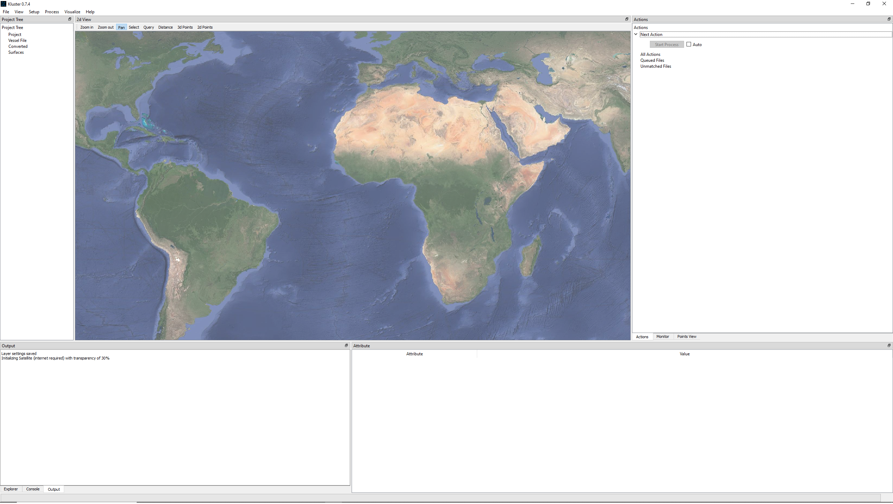
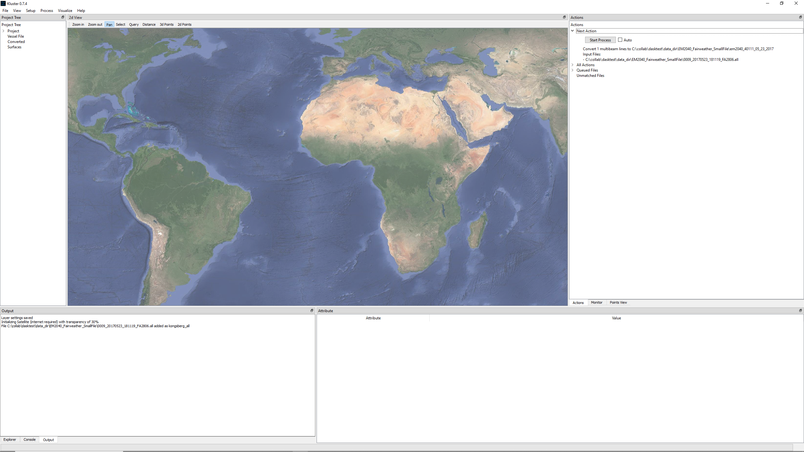
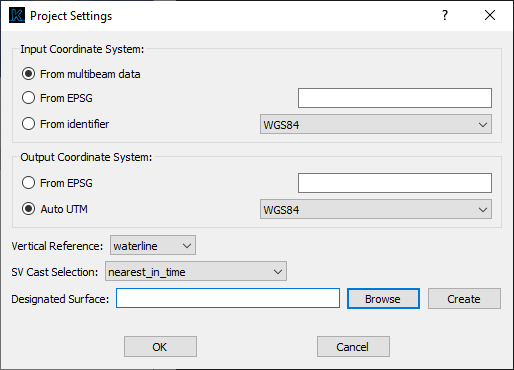
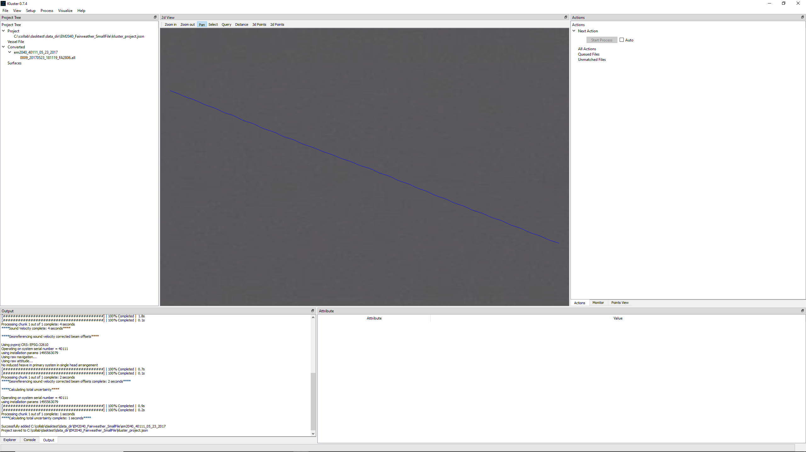
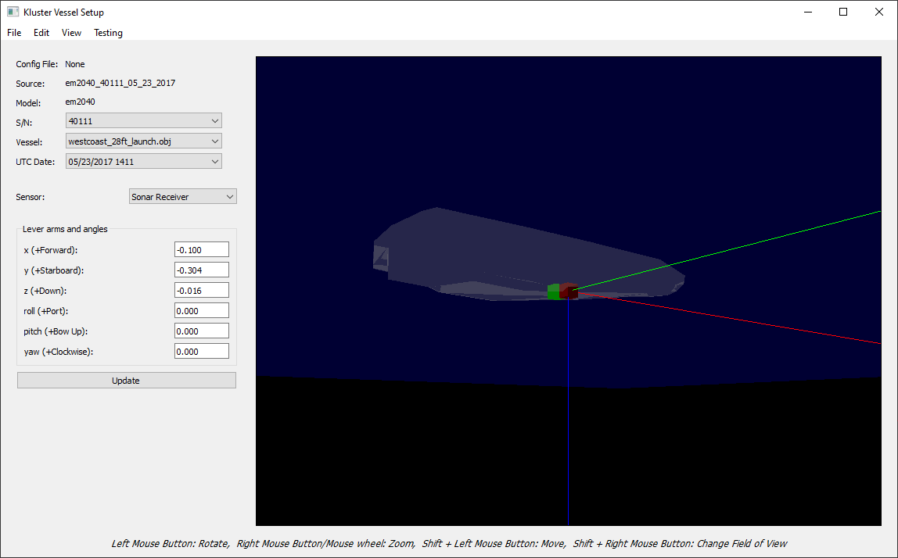
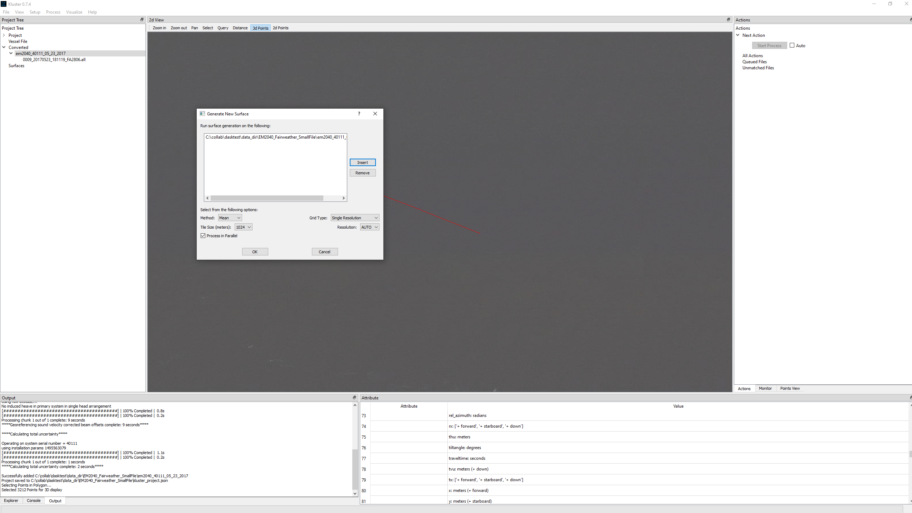
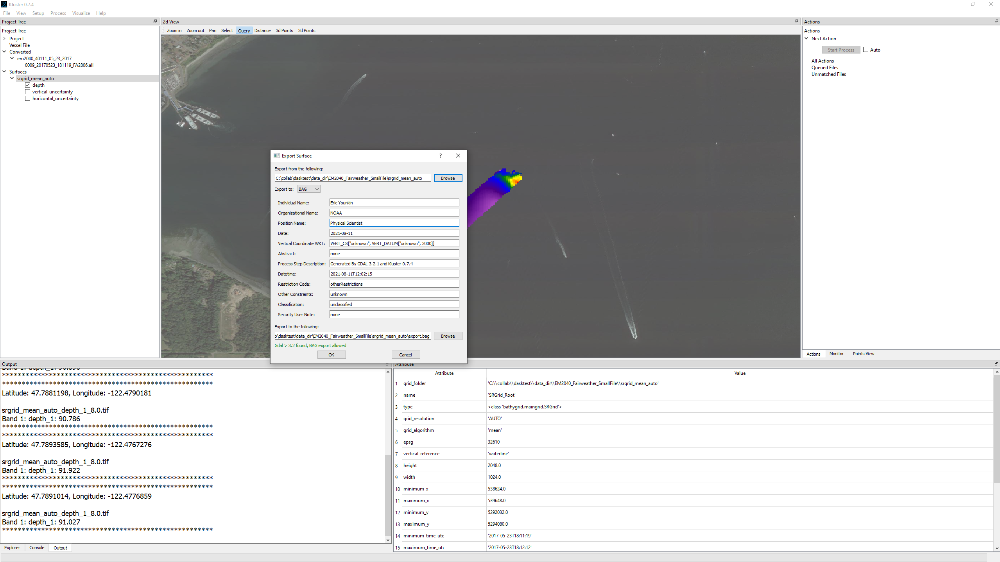
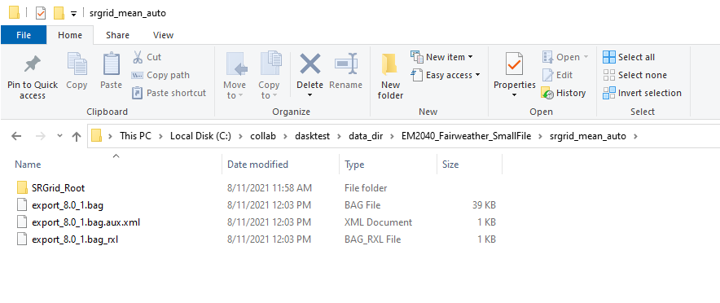

Quickstart - Basic
==================

Welcome to Kluster!  

If you want to learn more, try the YouTube series: `Kluster Playlist <https://www.youtube.com/playlist?list=PLrjCvP_J9AA_memBs2ZyKXGHG1AMx0GWx>`_

Kluster is an open-source multibeam processing system designed around ease of use and performance.  Currently Kluster supports Kongsberg multibeam formats (.all, .kmall), Caris SVP files (.svp) and Applanix POSPac SBET files (.sbet, .smrmsg), and you need to have at least a multibeam file to start.  I have one on the GitHub if you are just experimenting with this software:

`0009_20170523_181119_FA2806.all <https://github.com/noaa-ocs-hydrography/kluster/blob/master/test_data/0009_20170523_181119_FA2806.all>`_

Head to the `Kluster releases section <https://github.com/noaa-ocs-hydrography/kluster/releases>`_ to get the Kluster zip file for the version you want.  Use the latest unless you are after a specific version.  Unzip the file and run the kluster_main.exe to start Kluster.

If you want to start Kluster from source, run "python -m HSTB.kluster" from the shell after activating your conda environment.

Let's Process!
--------------

On startup, Kluster will look something like this:

.. image:: quickstart_1.png
   :target: ../_images/quickstart_1.png
 
The first thing you can do is experiment with background layers.  Go to View – Layer Settings and select one of the background layers.  Note that some require internet, these are marked as so.  If you know of some web map services that are not in this list, feel free to let me know and I can add them!  Here we are with the satellite layer and some transparency.

 
OK, so let us convert some data.  Drag a multibeam file into the application to get this display.  For this demo, we are just including a single line, but you can grab multiple lines at once if you like.

We have a new action (see the ‘Actions’ on the right) to convert this line.  All we need to do is hit ‘Start Process’ and it will start converting.  Since we did not setup a new project (‘File – New Project’) the converted data will go right next to the multibeam file along with a new project file ‘kluster_project.json’.  You will notice a 2 to 3 second delay right after hitting the ‘Start Process’ button.  That is the Dask Cluster starting up!  It powers all the parallel processing and must start the first time you hit that button.  Here we are with our new converted data.

.. image:: quickstart_4.png
   :target: ../_images/quickstart_4.png
 
If you get an error talking about the coordinate system, you might have converted data outside the NAD83 bounds.  Try changing to WGS84 in the ‘Setup – Project Settings’ and then restart Kluster and try again.  While we are in the settings, let us set the Vertical Reference that we want.  If you want to use the NOAA MLLW option, you need to ensure that:

- VDatum is installed and you are pointing to it in Kluster in ‘File – Settings’
- Our data is within the VDatum bounds (once you get VDatum installed, it becomes a background layer you can select to view the regions)

Otherwise pick a more basic reference such as ‘waterline’ (data referenced to the waterline of the vessel) or ‘ellipse’ (data referenced to the ellipsoid, either NAD83(GRS80)/WGS84 ellipsoid).

You can almost always leave the input coordinate system alone, unless you think the sonar was setup with the wrong coordinate system.

SV Cast Selection describes the way that we choose which sound velocity profile (cast) applies to each chunk of data during processing.  You can choose a different algorithm here, or leave it at the default, which will select the cast that is closest in time to that data chunk.

Designated Surface is a new features as of Kluster 0.9.6 that allows you to choose a surface (or create a new one) and have your data auto added to that surface as you process new data.  Leave it blank if you want to just manually create surfaces later.

As a side note, remember when I mentioned the Dask Cluster earlier?  You can also manually start the cluster with options that you select instead of letting Kluster auto start it.  You can find it under 'Setup - Dask Client'.  There isn't much there currently, but in the future, expect more advanced options for working in the Cloud!  When Kluster auto starts the cluster, we just use the Local Cluster.

.. image:: quickstart_6.png
   :target: ../_images/quickstart_6.png

We should quickly discuss the containers.  Each system/day combination gets its own container.  For instance, if you used the .all file that I have on my GitHub, you will see under the ‘Converted’ section in the Project Tree, there is an entry called ‘em2040_40111_05_23_2017’.  This is the model number, followed by the serial number, followed by the date of the data.  If you dragged in 100 multibeam files, the data across all files would be organized this way.  This allows you to drag in data from all over the place, across different systems and dates, and Kluster will just handle it.

.. image:: quickstart_7.png
   :target: ../_images/quickstart_7.png

With all that settled, you can now move on to the next action.  If you hover over the action in the Actions window, you can see the actions we are going to take.  They should reflect the settings you entered in the Project Settings.  Hit the Start Process button to complete the processing.  You will see that after we hit the start process button for the second time, there are no actions remaining.  Kluster is a two step process - first we convert data to the Kluster format, then we process the data to get the georeferenced soundings.

Analysis!
---------

Now we have finished the processing.  You can do a number of things here.  All data can be visualized in the Basic Plots widget.  Simply select the data container and click ‘Visualize – Basic Plots’.  Explore this one to get everything from animations of the beam vectors to plotted attitude and navigation.  Use the trim options or drag the sliders around to get different time sections of the data container to plot.  You can also optionally export from this widget to CSV if you want the time series for a variable or the full dataset.

.. image:: quickstart_9.png
   :target: ../_images/quickstart_9.png
 
There are also the advanced plots, which will be those plots useful for things like sonar acceptance tests.  Currently, there are only a few plots, like the extinction test and the accuracy test, but hopefully I will get around to building some more interesting ones in the future.  Here I am showing you the Wobble Test, based off of work done by John E. Hughes Clarke of the University of New Hampshire.  I find it to be a useful tool for analyzing wobbles in the data, particularly with isolating latency effects.

.. image:: quickstart_10.png
   :target: ../_images/quickstart_10.png

Kluster reads the offsets and angles from the raw data and uses that information during processing automatically.  You can see the values it read by selecting the converted instance and clicking on ‘Setup – Vessel Offsets’.  Here you get a ship display, a blue waterline plane, and some colored boxes for the sensors.  You can move the boat around to match your sensors if you want to make it look good.  I only have two boat models currently; you can even import your own stl model if you want to see it here.  I am using the westcoast launch vessel, it lines up ok.  If you select the sensor in the Sensor dropdown, you will see the offsets and angles for the system, and it will light up letting you know where it is in space.

Let's say you get a better answer for the Sonar Receiver lever arm after processing in Kluster.  You got the sign wrong on the Z value, it was supposed to be positive 0.016!  Not an issue, we can alter this value in Vessel Setup, click the Update button, close the Vessel Setup window saving the changes, and select 'No' in the next screen to update the multibeam data.  If you hit 'Yes', it will create a new vessel file, which is another more advanced way to track changes in your project.  

If you select 'No' after saving changes, you should see a new action for 'Process _____ starting with sound velocity'.  This is because a change in the offsets means we have to redo the sound velocity, georeferencing and TPU steps, which are the steps that use the lever arm values.  Mouse over the action to see the steps that we will perform.

.. image:: quickstart_12.png
   :target: ../_images/quickstart_12.png

Clicking on the converted entry in the Project Tree will also populate the Attribute window.  Here you can see all kinds of things, from the time a process was run to the sound velocity profiles contained in the converted data.  Some useful attributes:

- _xxxxx_complete - times in UTC for when each subprocess completed
- horizontal_crs - coordinate system for the project
- installsettings - the raw attributes from the multibeam data
- runtimesettings - the raw sonar settings from the multibeam data
- profile - the sound velocity profile data, with the time encoded in the name in UTC seconds
- attributes - the sound velocity profile attributes, with the time encoded in the name in UTC seconds
- multibeam_files - the files in this dataset with the [starttime, endtime] in UTC seconds

.. image:: quickstart_13.png
   :target: ../_images/quickstart_13.png
 
We previously mentioned the Dask Cluster that powers the Kluster parallel processing.  Well now that it is running, you can go to ‘View – Dashboard’ and get a dashboard of the cluster status.  This will display tasks currently running and the memory utilization across the workers.

.. image:: quickstart_14.png
   :target: ../_images/quickstart_14.png
 
Let us look at some soundings now.  Take your 3d Points map tool (see the tooltip for how to use) and select a cross section of our line like below.  You will see the points displayed in 3d in the Points View window.  Experiment with the options to get different views of the data.  The 2d Points works similarly, displaying the data in 2 dimensions in the Points View tool.

.. image:: quickstart_15.png
   :target: ../_images/quickstart_15.png

Gridding!
---------
 
Finally, let us talk grids.  Kluster uses the Bathygrid module I developed to do all the things we need a bathymetric gridding module to do.  With the converted data selected, go to ‘Process – New Surface’.  We can either build a single resolution grid or a variable resolution grid.  AUTO resolution follows the NOAA depth vs resolution specifications.  Let us just do a single resolution surface, AUTO resolution, and run in parallel.  The new surface will be in a folder right next to your processed multibeam data.

 
You will see a new entry under the surfaces category in the Project Tree.  Expand the dropdown and select the grid.  Clicking the entry populates the attributes in the Attribute window.  Currently no data is loaded from the surface, let us check ‘depth’ to load the depth layer.

.. image:: quickstart_17.png
   :target: ../_images/quickstart_17.png
 
Use the Query tool to get values under the mouse cursor.  Left click with Query to get a readout in the output window.  Hold CTRL and use the mouse wheel to zoom the output window if you have old eyes like me.

.. image:: quickstart_18.png
   :target: ../_images/quickstart_18.png

Finally, we can export the surface into something that other software can visualize.  Let us stick with the BAG format, which is the preferred file format for NOAA hydrography.  With the surface selected in the Project Tree, go to ‘File – Export Surface’.  Select ‘BAG’.  Some of the metadata is populated for you, such as the Vertical Coordinate WKT (which has our NOAA MLLW value, yours might be ‘unknown’ if you used waterline or ellipse).  Populate this dialog and hit OK.

 
Now we can look at our processed data.  Go to the folder that contains the multibeam file, and you will find folders like these:

.. image:: quickstart_20.png
   :target: ../_images/quickstart_20.png
 
The em240_40111_05_23_2017 folder contains the converted and processed data, similar to Caris HDCS.  You can take this folder and drag it into Kluster to reload that data.  The kluster_project.json file is the project file, you can drag it into Kluster to reload all the converted data at once.  The srgrid_mean_auto is the gridded data; you can drag it back into Kluster to reload the grid.  Inside the grid folder is our exported BAG file.  You'll see that there is a '_1' suffix in the BAG file.  Kluster will export large grids in tiles to avoid overly large exported BAGs that do not load efficiently in other software.  Kluster also uses these grid tiles under the hood for the display, you'll see the file names of the tiles when you use the query tool.
 

You should be able to drag this BAG file into software such as Caris or QGIS and get the same surface display.  

In the Console
--------------

All processing options are available in the Python console as well.  The simplest approach to processing is to use the intel_process (see API - fqpr_intelligence - intel_process)

.. code-block:: python

   from HSTB.kluster.fqpr_intelligence import intel_process

   fq = intel_process(r"C:\collab\dasktest\data_dir\EM2040_Fairweather_SmallFile\0009_20170523_181119_FA2806.all", coord_system='WGS84', vert_ref='waterline')

You can also run lower level processes as well.  Remember that Kluster is a two step process?  Let's run them seperately.  Note that if you do not use the intel_process, Kluster will not be able to do the organizing data by vessel/day task.  You just end up with a folder with all the processed data regardless of the date/vessel in the raw data.

.. code-block:: python

   from HSTB.kluster.fqpr_convenience import convert_multibeam, process_multibeam, perform_all_processing

   # only convert raw data to Kluster format
   fq = convert_multibeam(r"C:\collab\dasktest\data_dir\EM2040_Fairweather_SmallFile\0009_20170523_181119_FA2806.all")
   # now do the second step and process the Kluster data
   fq = process_multibeam(fq, coord_system='WGS84', vert_ref='waterline')
   # alternatively, perform both steps at the same time
   fq = perform_all_processing(r"C:\collab\dasktest\data_dir\EM2040_Fairweather_SmallFile\0009_20170523_181119_FA2806.all", coord_system='WGS84', vert_ref='waterline')

The 'fqpr' mentioned in the source code here is the Fully Qualified Ping Record, which is just the object that contains all the data for the processed file(s).  We can access the Xarray Dataset for the ping record by running the following (raw_ping is a list, where each element is a dataset for that head, dual head sonar would have two elements here)

.. code-block:: python

   # get the ping dataset
   ping_dataset = fq.multibeam.raw_ping[0]
   # navigation is in the ping dataset, but you can also get it separately like this
   navigation = fq.multibeam.return_raw_navigation()
   # attitude stored in a separate dataset to retain the high frequency data
   attitude = fq.multibeam.raw_att

Gridding is just as easy!

.. code-block:: python

   from HSTB.kluster.fqpr_convenience import generate_new_surface

   # generate a new surface without writing to disk
   surf = generate_new_surface(fq)
   # generate a new surface flushing to disk (usually necessary with moderate sized datasets
   surf = generate_new_surface(fq, output_path=r"C:\collab\dasktest\data_dir\EM2040_Fairweather_SmallFile\mygrid")

And that is it!  If you have concerns or issues, please consider submitting an issue on the GitHub here

`https://github.com/noaa-ocs-hydrography/kluster/issues <https://github.com/noaa-ocs-hydrography/kluster/issues>`_

.. toctree:: 
