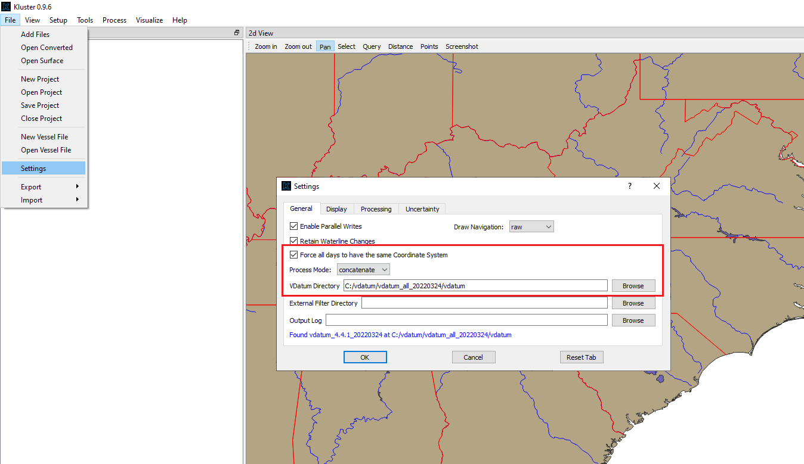
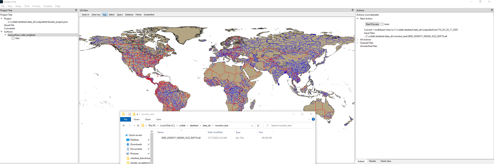
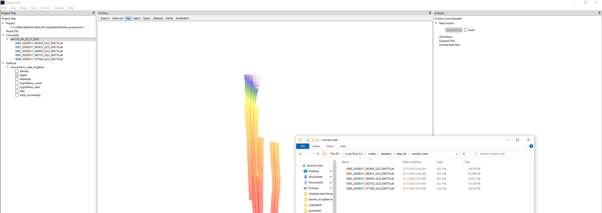
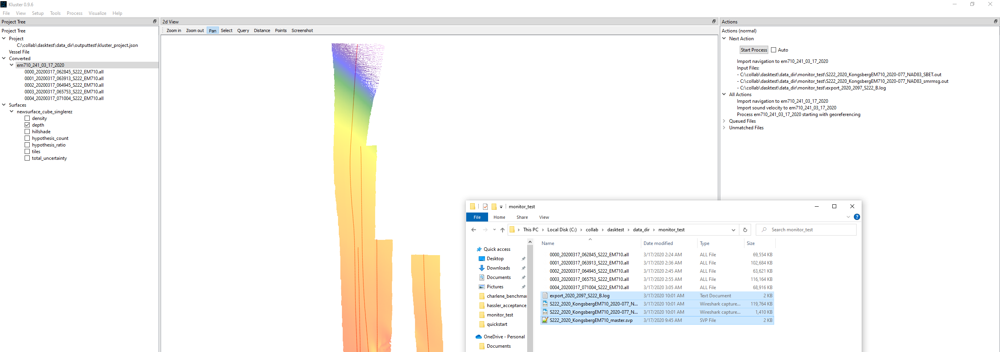

Quickstart - Monitor
====================

Welcome to Kluster!  

If you want to learn more, try the YouTube series: `Kluster Playlist <https://www.youtube.com/playlist?list=PLrjCvP_J9AA_memBs2ZyKXGHG1AMx0GWx>`_

Kluster is an open-source multibeam processing system designed around ease of use and performance.  Currently Kluster supports Kongsberg and Reson multibeam formats (.s7k, .all, .kmall), Caris SVP files (.svp) and Applanix POSPac SBET files (.sbet, .smrmsg), and you need to have at least a multibeam file to start.  I have one on the GitHub if you are just experimenting with this software:

`0009_20170523_181119_FA2806.all <https://github.com/noaa-ocs-hydrography/kluster/blob/master/test_data/0009_20170523_181119_FA2806.all>`_

Head to the `Kluster releases section <https://github.com/noaa-ocs-hydrography/kluster/releases>`_ to get the Kluster zip file for the version you want.  Use the latest unless you are after a specific version.  Unzip the file and run the kluster_main.exe to start Kluster.

If you want to start Kluster from source, run "python -m HSTB.kluster" from the shell after activating your conda environment.

Let's Process!
--------------

This is an advanced tutorial covering a more automated processing routine that you might use if you wanted to process as you collect data.  If you need information on the basic setup of Kluster, or a description of the windows, see the Quickstart - Basic page.

First, we need to setup Kluster for this monitoring mode.  Let's go to File - Settings and set a few things.  We want to check "Force all days to..." if we might be acquiring across two different UTM zones.  Each day in Kluster has it's own coordinate system, so if you don't have this checked, you might end up with days with two different zones.  You can also just specify an EPSG code in Project Settings, as this only really applies to the Auto UTM Zone option in Project Settings.  Either way, this is only for those huge surveys that might go across UTM zones.

Now we need to set Process Mode to Concatenate.  Concatenate mode will convert a line and then process that line individually.  If you add line after line to a project, concatenate mode will save you a lot of time by not reprocessing lines that have already been processed.  You do need to make sure that you go back to normal mode after you stop adding lines, just so that we get the new processing actions that come up when you change things after your initial processing.

I set the Vdatum Directory here, which is needed if you want to process to MLLW.

Now, we move over to Project Settings, and like we discussed, we leave the output coordinate system to Auto UTM (let it pick the UTM zone) and rely on "Force all days to..." to select the same coordinate system for all the days.

We also need to do something new, and select a Designated Surface.  This is only if you want to have a grid that gets automatically updated in the background as you add data to the project.  If so, we click the Create button (assuming you don't already have a grid) and create a new empty surface.  In the Save To box, we Browse and create a new empty folder to pick.  We select the gridding options that we want to use, I've got CUBE selected here, with the resolution automatically chosen based on the depth.

For cast selection, you are probably best off choosing nearest in time, as the converted casts don't really have meaningful positions (you'll get that later if you import SVP)

.. image:: quickstart_monitor_2.png
   :target: ../_images/quickstart_monitor_2.png

Now we are ready to setup the actual monitoring.  In the Monitor tab on the right, we browse to where we expect the new data to show up.  I have 'Include Subdirectories' checked as well, to search for data in folders that might be in this folder.  Any new data that it finds will be included, as well as whatever data might be in there already.  So if you have a few .all files in the directory and slowly add more over the course of the day, all of those files will be added to Kluster.  Hit 'Start' to start the monitoring.

NOTE: It is recommended to 'Stop' monitoring before closing Kluster, just so that it closes nicely.

.. image:: quickstart_monitor_3.png
   :target: ../_images/quickstart_monitor_3.png

Let's test it out here.  You can see below that I have added a .all file to the directory we are monitoring.  On the right, you can see that we have a new conversion action.  So far so good!  You can add multiple files at once if you like, you can also take away files to see the action change.

NOTE: If you want the processed data to live somewhere other than next to the raw data, go ahead and do a File - New Project and point to a different place.
 
The final step here is to check 'Auto' next to the 'Start Process' button in the top right.  It'll take a few seconds for the Dask Cluster to start (it locks up for a few seconds) and then the process begins.  It will cycle through Conversion, Processing, and Gridding one after the other.  The result is a processed multibeam container and a grid, and the processed data is in the grid.  We can turn on one of the layers to show this.

.. image:: quickstart_monitor_5.png
   :target: ../_images/quickstart_monitor_5.png

So let's test this process on multiple files.  Here I have thrown in four more .all files, with Auto checked, and let it run.  The result is that those four lines are processed one by one, and each line is added to the grid.

You can see that you can now just set Kluster up and conduct your survey, and you will end up with a processed dataset after you are done.  If you get a crash, or have to stop monitoring for some reason, you can restart Kluster in the same way and it will pick back up where you left it.

But this is never the end of the process, we often have to add files such as SVP or SBET files to the dataset.  Once you get to that point, you will need to change from 'Process Mode' = 'Concatenate' to 'Process Mode' = 'Normal' in 'Settings'.  This is so that we get our normal actions back, with reprocessing as additional data is imported to the dataset.

With a Normal Processing Mode, we can drag in our other files to the folder that we are monitoring.  You can see the result below.  Since we have an SBET/SMRMSG and POSPac Export Log, we are able to import the SBET to the dataset, and after that import we import the Sound Velocity Profile.  These actions are listed under 'All Actions' in the top right.  After these imports we need to restart the processing at sound velocity.  You can see that there is a 'Process ... starting with georeferencing' action currently, this will be updated as this new data is imported.

NOTE: If you have 'Auto' checked, all of this will automatically start as you drag in those files.

After that processing completes, you will end up with new soundings.  But we currently only have the old soundings in the surface!  The surface needs to be updated.

Right click on the surface and go to Update Surface.  You end up with a screen with two boxes, one on the left that shows the data in the surface, and one on the right that shows what is available to add to the surface.  Note that all the lines on the left match what we would expect to be in the surface, but they have little asterisks next to them.  These asterisks mark these lines for update, as Kluster knows that the newly processed data is newer than the data added to the grid.  If the Kluster version is newer, it gets an asterisk.  If you have 'Update Existing Container Data' checked, you will automatically remove/re-add all lines that have an asterisk.  And with 'Re-Grid Data' set to 'Only where points have changed', the whole grid will be re-gridded.

So the short answer is, you can basically just hit OK here.  This should remove/add the lines, and regrid.

.. image:: quickstart_monitor_8.png
   :target: ../_images/quickstart_monitor_8.png

.. image:: quickstart_monitor_9.png
   :target: ../_images/quickstart_monitor_9.png

And your screen should now look like mine.  You can see that all operations went smoothly.

At this point, you now have correctly processed data, and can move on to Analysis.  See Quickstart - Basic.

In the Console
--------------

All processing options are available in the Python console as well.  We are going to use the intel_service and generate_new_surface to do the operation. (see API - fqpr_intelligence - intel_process)

This is going to allow us to create a new grid and automatically process/add to that grid.

.. code-block:: python

   from HSTB.kluster.fqpr_intelligence import intel_process_service
   from HSTB.kluster.fqpr_convenience import generate_new_surface

   # generate a new empty surface for the designated surface.  You can use an existing surface if you like, and skip this step
   # use grid_parameters to alter the CUBE parameters
   surf = generate_new_surface(output_path=r"C:\collab\dasktest\data_dir\newsurf", tile_size=512.0, gridding_algorithm='cube', auto_resolution_mode='depth',
                               grid_parameters={'variance_selection': 'CUBE', 'iho_order': 'order1a', 'method': 'local'})
   # pass in that surface as the designated surface, start the processing service, which is a combination of the fqpr_intelligence.intel_process and folder monitoring
   fq = intel_process_service(r"C:\collab\dasktest\data_dir\EM2040_Fairweather_SmallFile", coord_system='WGS84', vert_ref='NOAA MLLW', process_mode='concatenate',
                              vdatum_directory=r'C:/vdatum/vdatum_all_20220324/vdatum', designated_surface=r"C:\collab\dasktest\data_dir\newsurf")

And that is it!  If you have concerns or issues, please consider submitting an issue on the GitHub here

`https://github.com/noaa-ocs-hydrography/kluster/issues <https://github.com/noaa-ocs-hydrography/kluster/issues>`_

.. toctree:: 
