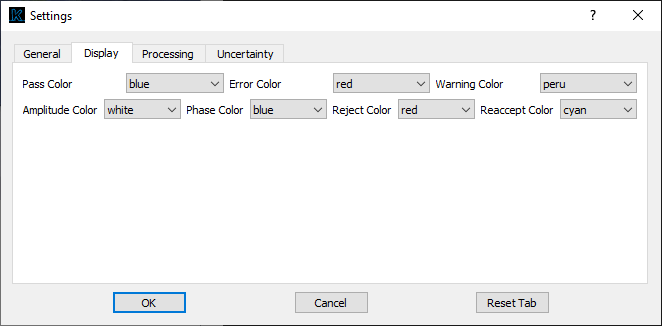
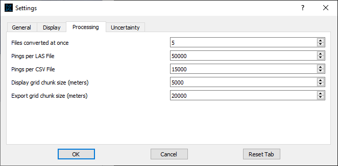
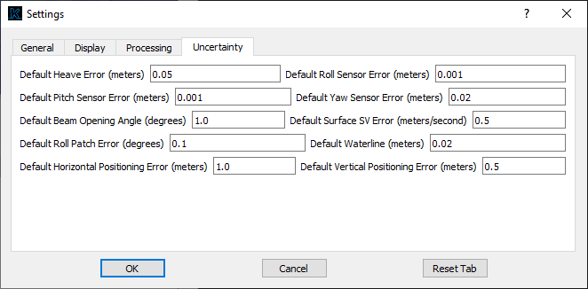
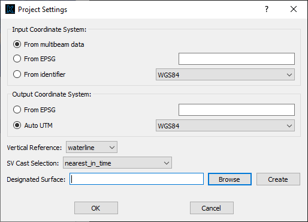

Settings
========

Much of Kluster is automated, and I try to minimize the amount of setup options available to the user through the graphical interface.  I do this intentionally (not just because I am lazy) because I think the potential users of Kluster are a diverse audience that want a streamlined processing system.  Something that isn't overwhelming, with toolbars and settings dialogs.  

In this section, I'll be discussing the settings available to configure in Kluster.  Note that all settings are saved to the kluster ini file (\\HSTB\\kluster\\misc\\kluster.ini) so that when the program reopens, the settings are repopulated.  Project related settings are also saved to the project file (kluster_project.json) and set on loading a new project file.

General Settings
----------------

General settings are accessed through the "File - Settings" menu.

.. image:: settings_1.png
   :target: ../_images/settings_1.png

- Enable Parallel Writes

Although this should not be the case, I have seen occasional issues with how Kluster writes to disk in parallel.  There should no longer be issues with PermissionsErrors and writes to disk, but if you were to see this again, disabling the parallel writes would most likely eliminate those.  It will also slow down the Kluster performance, so keep this checked if you can

- Retain Waterline Changes

Only used when you are using the Kluster vessel file.  With a vessel file loaded, when you add new multibeam data it will use the most recent entry in the vessel file for the offsets/angles/tpu parameters.  The vessel file will override the offsets/angles in the multibeam data.  This includes the waterline value, which is the one setting that might change
across days of data that you want to keep.  If you want to retain the waterline changes in new multibeam data, keep this checked.  Otherwise, waterline changes will not be saved to the vessel file.

- Force all days to have the same Coordinate System

This one is useful if you are using the Auto UTM option in project settings.  Sometimes you will have multibeam files in a project that span across multiple UTM zones.  If this is the case and this option is unchecked, each day of data will determine the best UTM zone to use in processing.  Check this option to force all added multibeam data to use the same UTM zone or EPSG code as the most prevalent epsg code currently used in the project.

- Process Mode

Controls what kind of processing actions will appear within Kluster.  See the following auto mode explanations for the currently available options:

NORMAL = Data is converted and processed as it comes in, where each line added would reprocess the whole day.  This is how Kluster generally operates.  You add 10 lines, it converts 10 lines and then generates a processing action to process 10 lines all the way through TPU calculation.

CONVERT ONLY = Data will only convert.  This can be useful if you want to process later.  Or if you just want access to the raw data for some reason

CONCATENATE = Data will convert as normal but processing actions will occur on a line by line basis and only if that line has not been processed.  This one is a bit more complicated.  If you were monitoring a directory as the sonar was running, you would get a new line, wait 10 minutes, get a new line, etc.  In normal mode, Kluster would convert one line and then fully process that line, and then convert the next line and fully process both lines.  In normal mode, full days get processed at a time.  In this mode, Kluster will convert and process line by line to save time when you are adding files every now and then.

WARNING: This mode will need to be changed back to normal mode if you want to use the processing actions generated as you change settings (i.e. changing vertical reference).  If you leave Kluster in concatenate mode, it will be satisfied with data that has been fully processed already regardless of settings.

- VDatum directory

Only used when you are using the 'NOAA MLLW' or 'NOAA MHW' options under vertical reference in Project Settings.  These two options require VDatum to perform the vertical transformation from ellipse to MLLW/MHW.  With VDatum provided, you are able to process using these two vertical references natively in Kluster, without the need for a separate gridded transformation file.

- Pass Color

Color of the text in the display when a test passes

- Error Color

Color of the text in the display when a test fails

- Warning Color

Color of the text in the display when a warning is issued

- Amplitude Color

Color of the soundings in Points View when colored by rejected and a sounding has an amplitude detect status

- Phase Color

Color of the soundings in Points View when colored by rejected and a sounding has a phase detect status

- Reject Color

Color of the soundings in Points View when colored by rejected and a sounding has a rejected status

- Reaccept Color

Color of the soundings in Points View when colored by rejected and a sounding has a reaccept status

- Files converted at once

The number of files that are converted at once, you can raise this if you have the memory to support it.  Can cause errors if you run out of memory.

- Pings per LAS file

When exporting soundings to LAS, this is the number of pings that are stored in each exported file.  Raise this number if you want larger chunked file exports.

- Pings per CSV file

When exporting soundings to CSV, this is the number of pings that are stored in each exported file.  Raise this number if you want larger chunked file exports.

This screen allows you to control the default uncertainty values used when converting and processing data.

Changes to these values will be reflected in the Setup - Vessel Offsets - Uncertainty screen for newly converted multibeam data.

NOTE: Default Beam Opening Angle will only be used when a multibeam file does not have a receiver beam opening angle value in the installation settings (which should not happen with Kongsberg systems)

Layer Settings
----------------

Layer settings are accessed through the "View - Layer Settings" menu.

.. image:: settings_2.png
   :target: ../_images/settings_2.png

- Background Layer

The layer to show behind the multibeam lines and surface.  The Default option uses the shapefiles found in (\\HSTB\\kluster\\background) and does not require internet.  You can actually replace these files if you like with the `higher resolution options <https://www.ngdc.noaa.gov/mgg/shorelines/>`_.  I don't, as mine are quicker to load and pan around, and I'm after performance in the default layer.  The Vdatum layer requires a Vdatum path in General Settings to a local instance of Vdatum.  All other layers require internet and a successful QGIS initialization.  If you find the other layers do not initialize correctly and you have internet, there must be an issue with the QGIS initialization.

- Background Transparency

Percent transparency to apply to the background layer(s)

- Surface Transparency

Percent transparency to apply to the surface layer(s)

Project Settings
----------------

Project settings are accessed through the "Setup - Set Project Settings"

- Coordinate System

The Coordinate System is used during georeferencing to project the sound velocity corrected offsets to northing/easting/depth values.  Altering the Coordinate System will produce a new georeference/TPU action.  The Coordinate System specified here will apply to all currently loaded days of data.

From EPSG will use an integer EPSG code to determine the coordinate system of this project.  See the currently available codes `here <https://epsg.org/home.html>`_  Note that the coordinate system provide must be a projected coordinate system with units in meters/feet.

Auto UTM is the primary way to set the coordinate system for a project.  This will use the provided coordinate system and the longitude of the provided data to automatically determine the appropriate UTM zone.  It will do this for each day, unless you use the Settings - Force all days to have the same Coordinate System option.  If that option is set and you are using Auto UTM, it will use the UTM zone of the first loaded day of data.

- Vertical Reference

The Vertical Reference used during georeferencing to go from reference point relative depths to the specified reference.  Altering the Vertical Reference will produce a new georeference/TPU action.  The Vertical Reference specified here will apply to all currently loaded days of data.

Waterline - sound velocity corrected offsets (relative to reference point) + heave - waterline

Ellipse - sound velocity corrected offsets (relative to reference point) - altitude

NOAA MLLW - sound velocity corrected offsets (relative to reference point) - altitude - MLLW Separation from VDatum

NOAA MHW - sound velocity corrected offsets (relative to reference point) - altitude - MHW Separation from VDatum

.. toctree::