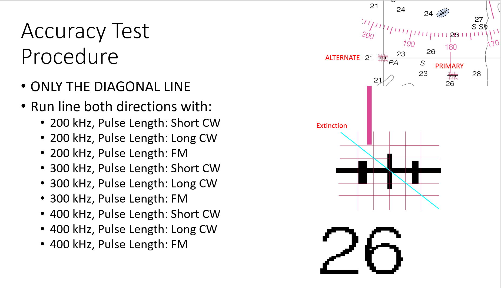

Accuracy Test
==============

The Accuracy Test will take your reference surface and show you some plots of the depth difference between the surface and some additional lines that you run.  These additional lines (Accuracy Test lines from here on) are run in both directions across the same line track, using all the different frequencies and modes of the system.  The final plots will give you an idea of the 'accuracy' of the system and can illustrate the quality of data you can expect at different frequencies and modes.

Here is our diagonal line plan showing the reference lines in the background.

To run this process in Kluster, you need to:

1. Generate a surface for the reference lines
2. Select the Converted entry for the Accuracy lines in the Project Tree and go to Visualize - Advanced Plots.
3. You will see the path to the converted data auto populate at the top of Advanced Plots, as well as the surface under Path to Kluster Surface.
4. Click Plot and the tool will run, plots will be saved to the directory shown at the bottom, and will also be automatically opened if you check 'Show Plots'

Here is an example run for my datasets:

.. image:: saaccuracy2.png
   :target: ../_images/saaccuracy2.png

I have an explanation in the Advanced Plots tool for how to interpret these plots, but I'll go through a quick explanation here as well.

1. The file name of each plot shows the mode and frequency for that portion of the dataset used in the plot ("CW-shCW-300000hz" means the plot is for the 300khz data run at continuous waveform/short CW modes)
2. The title of the plot indicates the average difference between accuracy data and surface depth.  I remove that difference from the plot so that we can focus on change across beams/angle.
3. The blue line is the mean depth for that beam/angle
4. The Order 1 line (grey) represents the 1.3% max allowable uncertainty wrt the depth range.
5. The Special Order line (green) represents the 0.75% max allowable uncertainty wrt the depth range.
6. The pink region represents two standard deviations from the mean.
7. The soundings are shown as white dots in he background (I limit it to 30,000 soundings to reduce the time it takes to display the plots)

In the example shown above, there is an approximately 0.3 meter offset between the accuracy lines and the reference surface depths, which isn't great.  These datasets I am working with
are using the ellipse as the vertical reference and are without SBETs, so we can expect there to be issues.  Our depth differences are within Order 1 (barely, remember to include our 0.3 meter depth offset) and the mean depth in our area is about 35 meters (which I know from processing the data, that information is not in the plot).

The port side of the sonar tends to be shoaler (negative depth bias, from grid to sounding) and the starboard tends to be deeper, which is interesting.  This is a dual head sonar, so it might have something to do with the mounting angles or offsets.