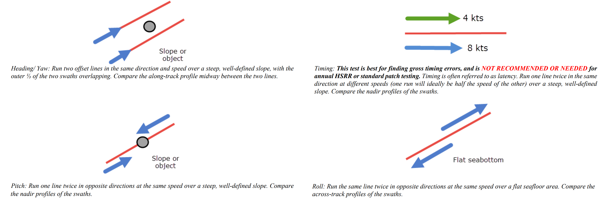
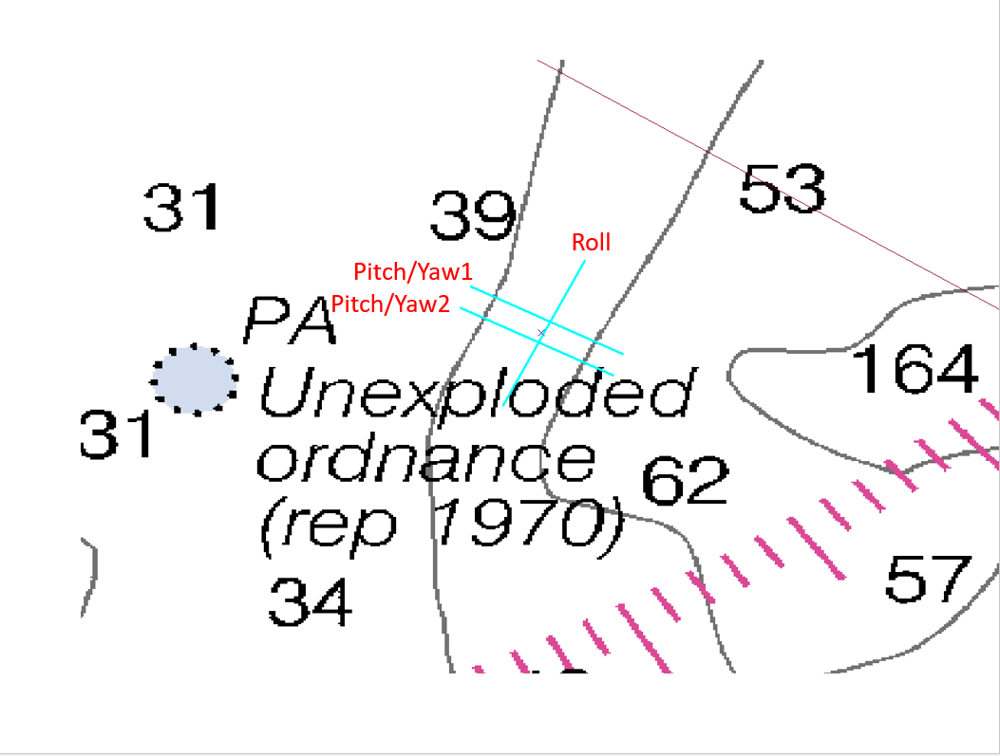

Patch Test
==========

This section will occasionally refer to the following documents:

NOAA Field Procedures Manual (FPM) - `See "Field Procedures Manual" section <https://nauticalcharts.noaa.gov/publications/standards-and-requirements.html>`_

The Patch Test or Multibeam Calibration Test is our way of attempting to correct for the inaccuracies of the vessel survey in data processing.  The vessel survey (at least modern vessel surveys that I have been involved in) will generally offer an assessment of the mounting angles of the sonar head(s) relative to the reference point that you use.  The mounting angles are given as roll, pitch and yaw, and are the relative difference in the orientation of the sonar head(s) relative to the reference point.  This is usually determined in a survey by surveying in the four corners of the sonar head and determining the slope in the three different directions of the resulting plane.

The way to refine these mounting angle values involves collecting multibeam data in different ways to emphasize the error and allow the user to pick different mounting angle values to reduce the error.  Below is an image from the FPM guidance on Patch Tests (Section 1.6.5.2)

And here is our planned lines for the Patch Test:

You will notice that we do not have a planned timing (latency) line.  We've found that trying to pick a latency value during the patch test doesn't work that well, or at least not as well as the purpose built latency test that I will be covering in that section.

You will want to acquire each of these three lines in both directions, at survey speed.  You'll also want to ensure that you collect a sound velocity profile cast before and after this acquisition period.

In the following sections, I will be using data that does not match my planning images.  I no longer have this data.  However, the procedure is pretty straightforward, so it shouldn't matter.  I've already processed the data in Kluster (see quick start section to learn more on how to do that) and I have a surface loaded as well.  I like to add some surface transparency (View - Layer Settings) and select my lines (2d View - Select) to see the attribution in the Explorer tab to get the heading info.  I also really like Dark Mode (view - Dark Mode)

Generally, you will run this test (the processing, not the acquisition) multiple times to get an average value for pitch, roll, yaw values.

For each test, you will want to select the points in a specific way, and then do basically the same steps:

1. Select the lines you want in the Points View, see the Show Lines button.  Only check your two lines.
2. Zoom in on an area to examine and Color by Linename in Points View.  Ensure that View = Arrow to see the area in the direction of the arrow on the Points tool.
3. Click the Patch Test button.  You will get a screen asking which entry you want to use.  Check the row that matches your patch test data.  There should only be one row ideally, if your patch test was over several days, you would have to check multiple entries here.
4. Click load.  You should now have the Patch Test screen.
5. Alter the correct value by an amount you think appropriate, and then press Update.  The points in the Points View will be reprocessed with this new angle and be re-displayed automatically.
6. Record the new value for this angle, and then move on to the next test

For each test, you will likely want to enter in the new values you have so far before proceeding.  For example, if you have done Pitch and are about to do Roll, you would enter in your new Pitch value in the Patch Test screen as well as the new Roll value that you are trying out.

Hold your mouse over the Points button to learn how to use it.

Pitch
******

Pitch is the same line run twice in opposite directions over a slope.  For our dataset, we will use lines 9 and 10, which satisfy this criteria.  We want to compare the nadir (center) beam of each line, so we can just generate a narrow box using the Points tool (2d View - Points) and center it on top of the lines.

Follow steps 1 through 6 above.  You should now have this display:

.. image:: sapatch3.png
   :target: ../_images/sapatch3.png

In this example, the slope isn't that substantial, so it is a little difficult to tell.

Determine your new Pitch value to make the slopes align.

Roll
******

Roll is the same line run twice in opposite directions across a slope or flat area.  We want to just compare a slice of the data in the across track direction.

Follow steps 1 through 6 above.  You should now have this display:

.. image:: sapatch4.png
   :target: ../_images/sapatch4.png

In this example, we aren't exactly going across a slope or in a flat area, so this is less than ideal.

Determine your new Roll value to make the slopes align.

Yaw
******

Yaw is two lines run in the same direction down a slope offset from each other.  You want to just get the overlap in the outer beams to exacerbate the error.  Compare a slice of data from both lines as shown in the image.

Follow steps 1 through 6 above.  You should now have this display:

.. image:: sapatch5.png
   :target: ../_images/sapatch5.png

In this example, we don't have a feature, and the slope is again less than ideal.

Determine your new Yaw value to make the slopes align.

Using the Results
*****************

After you have new Pitch, Roll and Yaw values, you can now update the existing values and reprocess.  This is done using the Vessel Offsets tool.  With your converted data selected in the Project Tree, go to Setup - Vessel Offsets, and you'll see the display showing you the vessel, waterline plane, and the sensor data.

You want to use the following sections:

Pitch = Sonar Transmitter Pitch
Roll = Sonar Receiver Roll
Yaw = Sonar Receiver Yaw

Update the values you see here with your new values, click the Update button and close the Vessel Setup window.  It will ask you if you want to save your changes.  Select Yes.  It will then ask if you want to use a vessel file or update the multibeam data offsets.  If you update the multibeam data, the angles that are in the converted data are updated and used during multibeam processing.  If you choose vessel, it will not update the converted multibeam data angles and instead build a vessel file that overrides the multibeam data offsets and angles.  You probably want to choose update, unless you are doing something else with vessel files.

Kluster will then generate a new processing action to reflect the fact that you are using different mounting angles and need to restart processing at Orientation.  Hit Start Process, and the data will be reprocessed with the new angles!