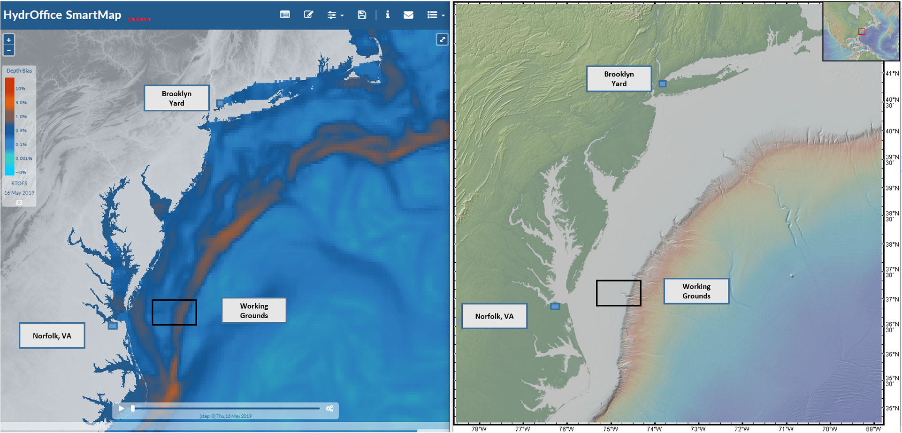
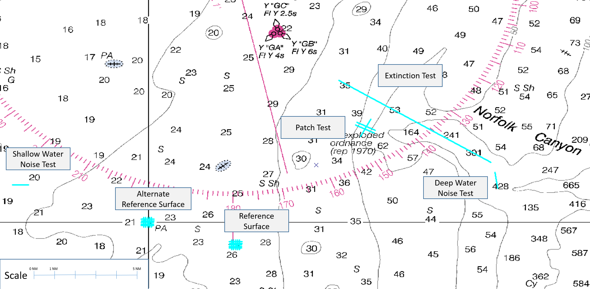

Planning
========

The first thing you need to do is determine the right area to work in.  You'll want different things for different tests:

1. Patch Test - slope or feature that you want to use
2. Reference Surface - nice flat area (maybe with a feature in the middle) that you can get back to again year after year
3. Accuracy Test - should overlap the Reference Surface test
4. Extinction Test - deep area, that can get deeper than the specified max depth for your system
5. Attitude Latency Assessment - see Patch Test

I used `SmartMap <https://www.hydroffice.org/smartmap/main>`_ to try and avoid areas where the sound speed is likely to be problematic.  On the east coast of the United States, if you are looking for a relatively deep area, you are likely to encounter some issues there regardless of your planning.

I would then build lines for each test, you can see an overview below.  I have zoomed in images in the article for each test, head back and check those out for more detailed images.

